# Certified Lean Six Sigma Black Belt (CLSSBB) Training — Learner Guide

**WSQ Course Code:** TGS-2024051900  |  **Conducted by:** Tertiary Infotech Academy Pte Ltd (UEN 201200696W)  |  **Version v2 · 19 July 2026**

## Contents

- [Introduction](#introduction)
- [Course Learning Outcomes](#course-learning-outcomes)
- [Skills Framework Alignment](#skills-framework-alignment)
- [Before You Start](#before-you-start)
- [FOUNDATIONS — The Black Belt Role, Portfolio Selection & Your Capstone  (10%)](#foundations--the-black-belt-role-portfolio-selection--your-capstone--10)
  - [Lab 1 — Select and Charter Your Capstone Project](#lab-1--select-and-charter-your-capstone-project)
  - [Lab 2 — Portfolio Selection, Strategy Alignment and the Black Belt Role](#lab-2--portfolio-selection-strategy-alignment-and-the-black-belt-role)
  - [Lab 3 — DMAIC at Depth — Recap, Y = f(X) and Baseline Sigma for Your Project](#lab-3--dmaic-at-depth--recap-y--fx-and-baseline-sigma-for-your-project)
- [DEFINE — Define at Black Belt Depth — Charter, Stakeholders & Change  (12%)](#define--define-at-black-belt-depth--charter-stakeholders--change--12)
  - [Lab 4 — Voice of the Customer, Affinity and Kano — In Depth](#lab-4--voice-of-the-customer-affinity-and-kano--in-depth)
  - [Lab 5 — CTQ Trees and CTQ Flowdown to Controllable Xs](#lab-5--ctq-trees-and-ctq-flowdown-to-controllable-xs)
  - [Lab 6 — SIPOC, Process Mapping and Scope Governance](#lab-6--sipoc-process-mapping-and-scope-governance)
  - [Lab 7 — Stakeholder Analysis, Resistance Management and Change Leadership](#lab-7--stakeholder-analysis-resistance-management-and-change-leadership)
- [MEASURE — Measure at Black Belt Depth — Advanced Measurement Systems  (16%)](#measure--measure-at-black-belt-depth--advanced-measurement-systems--16)
  - [Lab 8 — Value Stream Mapping, Takt Time and the Eight Wastes — In Depth](#lab-8--value-stream-mapping-takt-time-and-the-eight-wastes--in-depth)
  - [Lab 9 — Data Types, Operational Definitions and the Data Collection Plan](#lab-9--data-types-operational-definitions-and-the-data-collection-plan)
  - [Lab 10 — Sampling Strategy, Sample Size and Rational Subgrouping](#lab-10--sampling-strategy-sample-size-and-rational-subgrouping)
  - [Lab 11 — Continuous Gage R&R — In Depth](#lab-11--continuous-gage-rr--in-depth)
  - [Lab 12 — Attribute MSA and Kappa Analysis (Black Belt Only)](#lab-12--attribute-msa-and-kappa-analysis-black-belt-only)
  - [Lab 13 — Nested and Destructive Gauge Studies (Black Belt Only)](#lab-13--nested-and-destructive-gauge-studies-black-belt-only)
  - [Lab 14 — Baseline Capability — Cp, Cpk, Pp, Ppk and Non-Normal Data](#lab-14--baseline-capability--cp-cpk-pp-ppk-and-non-normal-data)
- [ANALYZE — Analyze at Black Belt Depth — Advanced Statistical Analysis  (22%)](#analyze--analyze-at-black-belt-depth--advanced-statistical-analysis--22)
  - [Lab 15 — Variation, Run Charts, Pareto and Stratification — In Depth](#lab-15--variation-run-charts-pareto-and-stratification--in-depth)
  - [Lab 16 — Fishbone, 5 Whys and Cause Prioritisation — In Depth](#lab-16--fishbone-5-whys-and-cause-prioritisation--in-depth)
  - [Lab 17 — Hypothesis Testing — In Depth, With Test Selection](#lab-17--hypothesis-testing--in-depth-with-test-selection)
  - [Lab 18 — Multiple Regression and Model Diagnostics (Black Belt Only)](#lab-18--multiple-regression-and-model-diagnostics-black-belt-only)
  - [Lab 19 — ANOVA, Interactions and Non-Parametric Tests (Black Belt Only)](#lab-19--anova-interactions-and-non-parametric-tests-black-belt-only)
  - [Lab 20 — Multi-Vari Studies and Chi-Square Analysis (Black Belt Only)](#lab-20--multi-vari-studies-and-chi-square-analysis-black-belt-only)
  - [Lab 21 — Analyze Tollgate — Proving Root Cause and Telling the Data Story](#lab-21--analyze-tollgate--proving-root-cause-and-telling-the-data-story)
- [IMPROVE — Improve at Black Belt Depth — Design of Experiments  (18%)](#improve--improve-at-black-belt-depth--design-of-experiments--18)
  - [Lab 22 — Solution Generation, Selection and Lean Countermeasures — In Depth](#lab-22--solution-generation-selection-and-lean-countermeasures--in-depth)
  - [Lab 23 — Full Factorial Design of Experiments (Black Belt Only)](#lab-23--full-factorial-design-of-experiments-black-belt-only)
  - [Lab 24 — Fractional Factorial Designs, Confounding and Resolution (Black Belt Only)](#lab-24--fractional-factorial-designs-confounding-and-resolution-black-belt-only)
  - [Lab 25 — Response Surface Methodology and Robust Design (Black Belt Only)](#lab-25--response-surface-methodology-and-robust-design-black-belt-only)
  - [Lab 26 — FMEA, Pilot Design and Implementation Planning — In Depth](#lab-26--fmea-pilot-design-and-implementation-planning--in-depth)
- [CONTROL — Control at Black Belt Depth — Advanced SPC & Sustaining  (12%)](#control--control-at-black-belt-depth--advanced-spc--sustaining--12)
  - [Lab 27 — Statistical Process Control and Chart Selection — In Depth](#lab-27--statistical-process-control-and-chart-selection--in-depth)
  - [Lab 28 — CUSUM, EWMA and Short-Run SPC (Black Belt Only)](#lab-28--cusum-ewma-and-short-run-spc-black-belt-only)
  - [Lab 29 — Multivariate SPC and Control Plan Governance (Black Belt Only)](#lab-29--multivariate-spc-and-control-plan-governance-black-belt-only)
  - [Lab 30 — Financial Benefits Validation, Handover and Project Closure](#lab-30--financial-benefits-validation-handover-and-project-closure)
- [CAPSTONE — Capstone Project & Steering Committee Presentation  (10%)](#capstone--capstone-project--steering-committee-presentation--10)
  - [Lab 31 — Consolidating Your Capstone — The A3 Storyboard](#lab-31--consolidating-your-capstone--the-a3-storyboard)
  - [Lab 32 — Building the Steering Committee Presentation](#lab-32--building-the-steering-committee-presentation)
  - [Lab 33 — Capstone Presentation and Defence](#lab-33--capstone-presentation-and-defence)
  - [Lab 34 — Lessons Learned, Mentoring Green Belts and Your Black Belt Journey](#lab-34--lessons-learned-mentoring-green-belts-and-your-black-belt-journey)
- [Quick Reference — Formulas You Should Know](#quick-reference--formulas-you-should-know)
- [Quick Reference — The Eight Wastes (DOWNTIME)](#quick-reference--the-eight-wastes-downtime)
- [Preparing for the Assessment](#preparing-for-the-assessment)
- [Glossary](#glossary)

## Introduction

This Learner Guide accompanies the WSQ course Certified Lean Six Sigma Black Belt (CLSSBB) Training (TGS-2024051900), conducted by Tertiary Infotech Academy Pte Ltd. It follows the DMAIC roadmap end to end — Define, Measure, Analyze, Improve, Control — and provides step-by-step instructions for every hands-on lab. Every lab is a capstone building block - its output goes directly into the project you present and defend on Day 5.

The course content is grounded in the body of knowledge published by The Council for Six Sigma Certification (CSSC) in 'Six Sigma: A Complete Step-by-Step Guide', so what you learn here matches the recognised Black Belt standard.

This course is the deliberate step up from the Green Belt (CLSSGB, TGS-2025055775). DMAIC is recapped IN DEPTH — because a Black Belt must be able to MENTOR Green Belts through these tools, and you cannot coach what you only half-recall — and then extended with the advanced material the Green Belt course does not teach: attribute MSA and Kappa analysis, nested and destructive gauge studies, multiple regression with model diagnostics, ANOVA and interaction effects, non-parametric tests, multi-vari studies, full and fractional factorial Design of Experiments, response surface methodology, Taguchi robust design, CUSUM, EWMA and multivariate SPC, change leadership, and financial benefits validation.

YOUR CAPSTONE PROJECT RUNS FROM DAY 1. In Lab 1 you select a real process from your own workplace and charter it. Every lab thereafter adds one artifact to that same project — the measurement study, the regression model, the experiment design, the control plan. On Day 5 you consolidate those artifacts into an A3 storyboard and present and defend it to a steering committee. There is no practice exam and no written or practical assessment paper: the capstone project and presentation ARE the assessment. A worked reference scenario (Meridian Medical Devices — infusion pump assemblies across three plants) is provided throughout for learners who cannot use workplace data.

## Course Learning Outcomes

- LO1: Lead a Lean Six Sigma project portfolio — select, charter and govern projects aligned to business strategy (A1, A2).
- LO2: Validate measurement systems for continuous AND attribute data using Gage R&R and Kappa analysis (A4).
- LO3: Analyse process data using multiple regression, ANOVA, non-parametric tests and multi-vari studies (A3).
- LO4: Design, run and interpret experiments using full and fractional factorial DOE and response surface methods (A3, K2).
- LO5: Select, de-risk and pilot improvements, and validate financial benefits with Finance sign-off (A5).
- LO6: Sustain the gain using advanced SPC — CUSUM, EWMA, short-run and multivariate control charts (A5, K1).
- LO7: Lead change and mentor Green Belts through resistance, stakeholder management and tollgate governance (A1, K1).
- LO8: Deliver a capstone improvement project and present it to a steering committee (A1-A5, K1, K2).

## Skills Framework Alignment

This course is aligned to the WSQ Technical Skills and Competencies (TSC) Quality Process Control (ELE-QUA-5006-1.1).

**Abilities**

- A1: Lead improvement projects to meet process performance requirements.
- A2: Establish project scope of work and resourcing based on organisational requirements.
- A3: Analyse process performance data using advanced statistical methods to identify root causes of variation.
- A4: Measure process performance against defined quality standards and validate the measurement system.
- A5: Recommend, pilot and control improvement actions to sustain process performance.

**Knowledge**

- K1: DMAIC methodology and the advanced Lean Six Sigma body of knowledge.
- K2: Advanced statistical tools, experimental design and problem-solving techniques for process improvement.

## Before You Start

**What you need**

- A laptop with a spreadsheet application (Microsoft Excel, Google Sheets or LibreOffice Calc).
- A browser, for the interactive problem-solving tools used in the Analyze labs.
- The course slides and this Learner Guide, downloaded from https://lms-tms.tertiaryinfotech.com.
- A REAL process from your own workplace, with accessible data — this becomes your capstone project.

**The interactive problem-solving toolkit**

Four browser-based tools are used during the labs. No installation or licence is required.

- 5 Whys — build and share a 5 Whys chain: https://alfredang.github.io/5whys/
- Fishbone Diagram — build an Ishikawa cause-and-effect diagram: https://alfredang.github.io/fishbone/
- Pareto Chart (collaborative) — your team brainstorms and votes in one live session and the Pareto chart builds itself: https://alfredang.github.io/paretochart/
- NovaSPC — run charts, SPC charts and process capability from your own CSV: https://alfredang.github.io/novaspc/

**How the labs work**

- Every lab is a CAPSTONE BUILDING BLOCK — its output goes straight into your capstone project pack.
- Labs are completed in order because later labs consume the charter, baseline, measurement study and analysis built earlier.
- Apply every lab to your OWN workplace process; use the Meridian Medical Devices scenario only as a fallback.

**Conventions used in every lab**

- Each lab states its objective, the deliverable you produce, the steps, and a check to confirm you are done.
- Tables shown in the steps can be built in a spreadsheet or on the worksheet provided.
- Where a lab uses an online tool, the tool URL is shown with the step.
- Keep every lab output — they combine into the capstone project you present and defend on Day 5.

## FOUNDATIONS — The Black Belt Role, Portfolio Selection & Your Capstone  (10%)

BB vs GB · Portfolio selection · Strategy alignment · COPQ · Capstone chartering · DMAIC at altitude

**Key concepts**

- The Black Belt role — The Green Belt leads one project; the Black Belt leads a portfolio, owns the statistics and mentors Green Belts.
- Project portfolio selection — Rank candidate projects on strategic fit, financial benefit, data availability and risk — say no to the rest.
- Strategy alignment (Hoshin) — Every project must trace up to a business objective, or it will lose its sponsor mid-flight.
- Cost of Poor Quality at scale — Roll COPQ up across a portfolio so the programme, not just the project, has a dollar figure.
- The capstone project — You choose YOUR workplace process on Day 1 and build it across every lab of this course.
- Chartering your capstone — Problem, goal, scope, business case, sponsor and team — written on Day 1, refined at every tollgate.
- DMAIC at altitude — A fast, assumed-knowledge recap of the five phases from the Black Belt's leadership vantage point.
- Tollgate governance — The Black Belt runs the tollgate; the sponsor decides go, adjust or kill at the end of each phase.

### Lab 1 — Select and Charter Your Capstone Project

Objective: Select a viable Black Belt project from a candidate portfolio and charter it (A1, A2).

Goal: This is the most important lab of the course — everything you build for the next five days attaches to the project you select here. Screen candidate projects the way a Black Belt does: against strategic fit, financial benefit, data availability and risk. Then write the charter that will govern the work. CAPSTONE BUILDING BLOCK — the output of this lab goes directly into your capstone project pack, which you present to the steering committee on Day 5.

**What you'll build**

A scored project selection matrix and a signed-off capstone project charter.   (Tools and techniques: Portfolio screening, strategic alignment, COPQ estimate, project charter, sponsor agreement.)

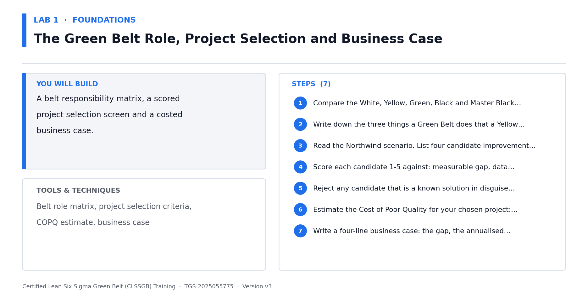

*Lab 1 at a glance — the deliverable, the tools and the steps.*

**Step-by-step**

1. Choose your capstone process. Strongly preferred: a real process from your own workplace where you can obtain data. Fallback: the Meridian Medical Devices scenario.
2. List at least five candidate improvement projects within that process or business area. Write each as a PROBLEM, never as a solution.
3. Build a project selection matrix. Score each candidate 1-5 on: strategic fit, annualised financial benefit, data availability, scope manageability, sponsor commitment and technical risk.
4. Weight the criteria — strategic fit and financial benefit usually carry the highest weight — and compute a weighted total for each candidate.
5. Reject any candidate that is a solution in disguise ('deploy a new MES'), has no accessible data, or has no named sponsor. Record WHY each was rejected.
6. Select your capstone project — the highest weighted score that survives the rejection filters.
7. Estimate the Cost of Poor Quality for the selected project: scrap, rework, warranty, expedite, lost margin and capacity consumed. Annualise it.
8. Write the charter: business case, problem statement, goal statement (SMART), scope (in/out), preliminary Y, team, sponsor, milestones and expected benefit.
9. Write your problem statement to the four-part test: the process, the time period, the measurable gap and the business impact — with no cause and no solution in it.
10. Identify your sponsor and record what you need from them. Where possible, obtain real sign-off before Day 2.

**Check your work**

You have a weighted selection matrix with at least five scored candidates, a documented rejection rationale, an annualised COPQ figure, and a complete charter whose problem statement contains no cause and no solution.

> **Note:** The full worksheet for this lab is in labs/lab-01-*.md.

---

### Lab 2 — Portfolio Selection, Strategy Alignment and the Black Belt Role

Objective: Align a project portfolio to business strategy and define the Black Belt's leadership role (A1, K1).

Goal: A Green Belt is handed a project; a Black Belt decides which projects exist. Practise the portfolio view — trace every candidate up to a business objective, balance the portfolio across DMAIC maturity and risk, and articulate what you as Black Belt own that a Green Belt does not.

**What you'll build**

A strategy-to-project traceability map and a Black Belt accountability charter.   (Tools and techniques: Hoshin alignment, portfolio balance, belt role matrix, mentoring model, tollgate governance.)

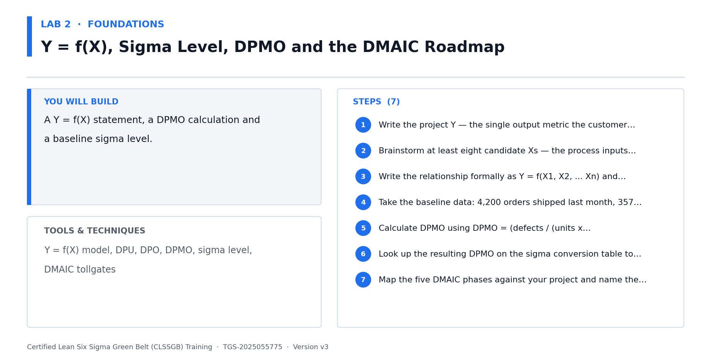

*Lab 2 at a glance — the deliverable, the tools and the steps.*

**Step-by-step**

1. Write down your organisation's top three business objectives for the current year (or Meridian's: OTIF to 95%, warranty cost down 30%, yield parity across plants).
2. Map each of your five candidate projects from Lab 1 to the objective it serves. Any project that maps to nothing is a candidate for cancellation.
3. Build the belt responsibility matrix: White, Yellow, Green, Black, Master Black Belt and Champion. For each, record who leads, who analyses, who mentors and who sponsors.
4. List the five things a Black Belt does that a Green Belt does not — lead a portfolio, own advanced statistics, mentor Green Belts, run tollgates, validate benefits with Finance.
5. Assess portfolio balance: are all your projects in one phase, one plant or one function? A healthy portfolio is spread across risk and time-to-benefit.
6. Identify which of your candidate projects should be delegated to a Green Belt under your mentorship rather than led by you. Record the reasoning.
7. Define the tollgate cadence for your capstone: what evidence closes Define, Measure, Analyze, Improve and Control, and who signs each one off.
8. Write your Black Belt accountability charter — what you own, what you delegate, what you escalate.

**Check your work**

Every candidate project traces to a named business objective, your belt matrix distinguishes Black from Green Belt accountability, and your capstone has a defined five-tollgate governance plan.

> **Note:** The full worksheet for this lab is in labs/lab-02-*.md.

---

### Lab 3 — DMAIC at Depth — Recap, Y = f(X) and Baseline Sigma for Your Project

Objective: Re-derive the DMAIC roadmap and express your capstone as Y = f(X) with a baseline sigma level (K1, A4).

Goal: A thorough recap of the DMAIC roadmap — not a skim, because you must be able to mentor Green Belts through it. Then apply it: express your capstone problem as Y = f(X), and convert your baseline defect data into DPMO and a sigma level so improvement can be proven numerically at the end. CAPSTONE BUILDING BLOCK — the output of this lab goes directly into your capstone project pack, which you present to the steering committee on Day 5.

**What you'll build**

A DMAIC tollgate map, a Y = f(X) model and a baseline DPMO / sigma level for your capstone.   (Tools and techniques: DMAIC roadmap, tollgate deliverables, Y = f(X), DPU, DPO, DPMO, sigma level, sigma shift.)

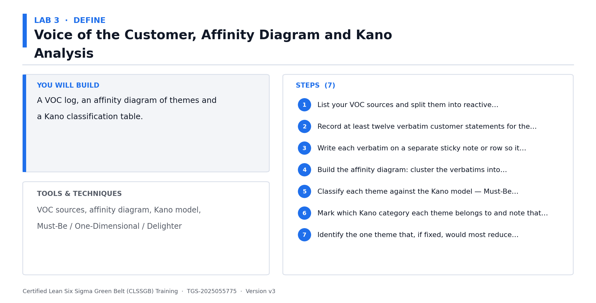

*Lab 3 at a glance — the deliverable, the tools and the steps.*

**Step-by-step**

1. Recap each DMAIC phase in full: its purpose, its core tools, its tollgate deliverable and the most common way teams fail in it.
2. For each phase, write the one question that phase answers — Define: what problem? Measure: how big? Analyze: why? Improve: what fix? Control: how do we hold it?
3. Write your capstone project Y — the single output metric your customer actually feels. It must be measurable and it must already have data.
4. Brainstorm at least twelve candidate Xs that could drive that Y. Classify each as controllable, noise or SOP-governed.
5. Write the relationship formally as Y = f(X1, X2, ... Xn), and mark which Xs you can experiment on later in the DOE labs.
6. Collect or estimate your baseline: units processed, defects observed and opportunities per unit over a defined recent period.
7. Calculate DPU, DPO and DPMO. Show the formulas: DPU = defects/units; DPO = defects/(units x opportunities); DPMO = DPO x 1,000,000.
8. Convert DPMO to a baseline sigma level using the conversion table, and state whether the 1.5-sigma long-term shift is included.
9. Record this baseline in your capstone pack — every improvement claim on Day 5 is measured against this number.

**Check your work**

You can explain all five DMAIC tollgates without notes, your Y is a measurable customer-facing output with at least twelve classified Xs, and your baseline DPMO and sigma level are calculated from real counts.

> **Note:** The full worksheet for this lab is in labs/lab-03-*.md.

---

## DEFINE — Define at Black Belt Depth — Charter, Stakeholders & Change  (12%)

VOC recap · Advanced CTQ flowdown · Charter governance · Stakeholder & resistance analysis · Change leadership

**Key concepts**

- VOC, affinity and Kano — in depth — Re-derive VOC capture, affinity clustering and Kano classification in full — you must be able to teach these, not just use them.
- CTQ trees — in depth — Build the CTQ tree from need to driver to measurable requirement, with targets, specification limits and defect definitions.
- CTQ flowdown — Cascade a business-level Y down through sub-Ys to the process Xs a team can actually control.
- Charter governance — The charter is a living contract — re-baselined at each tollgate, not written once and filed.
- Stakeholder analysis — Map influence against support, then plan a specific move for every high-influence, low-support stakeholder.
- Resistance management — Resistance is data. Diagnose whether it is technical, political or cultural before responding.
- Change leadership — ADKAR and Kotter — Awareness, Desire, Knowledge, Ability, Reinforcement across the project life.
- Communication planning — Different audiences need different messages at different cadences — plan it, do not improvise.
- Mentoring Green Belts — The Black Belt coaches Green Belt project definition rather than doing it for them.

### Lab 4 — Voice of the Customer, Affinity and Kano — In Depth

Objective: Capture and classify VOC for your capstone using affinity and Kano analysis (A1, K2).

Goal: A full re-derivation of VOC, affinity clustering and Kano classification — taught to the depth at which you could run this session yourself for a Green Belt team. Then apply all three to your own capstone process. CAPSTONE BUILDING BLOCK — the output of this lab goes directly into your capstone project pack, which you present to the steering committee on Day 5.

**What you'll build**

A VOC log, an affinity diagram and a Kano classification for your capstone customers.   (Tools and techniques: Reactive & proactive VOC, verbatim capture, affinity clustering, Kano model, customer segmentation.)

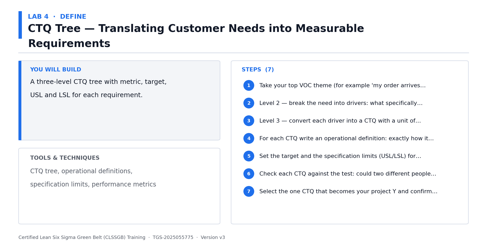

*Lab 4 at a glance — the deliverable, the tools and the steps.*

**Step-by-step**

1. Recap the VOC sources in full: reactive (complaints, returns, warranty, escalations, social) and proactive (interviews, surveys, gemba, observation).
2. Segment your capstone customers — internal and external. Different segments will give contradictory VOC, and that contradiction is itself data.
3. Collect at least fifteen verbatim statements about your capstone process. Use the customer's own words; do not summarise them into your own.
4. Recap affinity diagram method: silent clustering first to avoid anchoring on the loudest voice, then name the clusters by consensus.
5. Build the affinity diagram for your verbatims. Aim for five to eight named themes.
6. Recap the Kano model in full: Must-Be, One-Dimensional, Delighter, Indifferent and Reverse — and how categories migrate over time as delighters become expectations.
7. Classify each affinity theme against Kano. Note explicitly that Must-Be requirements can only ever cause dissatisfaction, never satisfaction.
8. Identify the one or two themes that most drive your project Y, and record them as your CTQ candidates for the next lab.
9. Note how you would coach a Green Belt through this exercise — what mistake would you expect them to make?

**Check your work**

You have fifteen or more verbatims, every verbatim sits in a named affinity cluster, every cluster carries a Kano classification, and your CTQ candidates trace to specific verbatims.

> **Note:** The full worksheet for this lab is in labs/lab-04-*.md.

---

### Lab 5 — CTQ Trees and CTQ Flowdown to Controllable Xs

Objective: Translate VOC into measurable CTQs and cascade a business Y down to controllable Xs (A1, A4).

Goal: A customer need is not measurable; a CTQ is. Re-derive the CTQ tree in full, then go beyond Green Belt with CTQ FLOWDOWN — cascading a business-level Y through sub-Ys until you reach process Xs a team can actually control. CAPSTONE BUILDING BLOCK — the output of this lab goes directly into your capstone project pack, which you present to the steering committee on Day 5.

**What you'll build**

A CTQ tree with targets and specification limits, plus a flowdown to controllable Xs.   (Tools and techniques: CTQ tree, need-driver-requirement, operational definitions, specification limits, Y-to-X cascade.)

*Lab 5 at a glance — the deliverable, the tools and the steps.*

**Step-by-step**

1. Recap the CTQ tree structure in full: Need -> Drivers -> Measurable Requirements, with each level more specific than the last.
2. Take your top VOC theme and drive it down: what is the need, what drives it, and what specifically must be measured?
3. For each CTQ, write a complete operational definition — what is measured, by whom, with what instrument, at what point, and what counts as a defect.
4. Set the target, the upper and lower specification limits, and the defect definition for each CTQ. A CTQ without limits cannot generate a defect count.
5. Verify each CTQ against the customer: would they agree this number represents what they asked for?
6. Now flow down. Write your business-level Y (e.g. OTIF percentage) at the top of a cascade diagram.
7. Break that Y into sub-Ys — the process-level outputs that roll up into it (pick accuracy, line yield, changeover time, carrier dwell).
8. Break each sub-Y into the Xs that drive it. Continue until you reach Xs a team can directly control or experiment on.
9. Mark on the cascade which Xs you will measure in Day 2, test statistically in Day 3, and experiment on in Day 4.

**Check your work**

Every CTQ has an operational definition, a target and specification limits, and your flowdown reaches at least one layer of Xs that are directly controllable and testable.

> **Note:** The full worksheet for this lab is in labs/lab-05-*.md.

---

### Lab 6 — SIPOC, Process Mapping and Scope Governance

Objective: Map your capstone process and govern its scope through the charter (A2).

Goal: Re-derive SIPOC and detailed process mapping in full, then apply them to bound your capstone. Scope creep kills more Black Belt projects than bad statistics — this lab builds the map that makes scope arguments objective. CAPSTONE BUILDING BLOCK — the output of this lab goes directly into your capstone project pack, which you present to the steering committee on Day 5.

**What you'll build**

A SIPOC, a detailed swimlane process map and a documented scope boundary.   (Tools and techniques: SIPOC, process boundaries, swimlane mapping, handoff analysis, rework loops, scope control.)

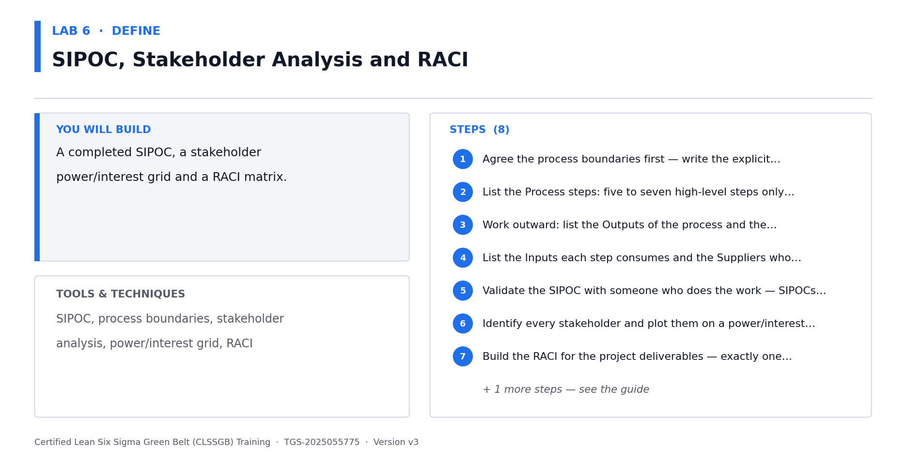

*Lab 6 at a glance — the deliverable, the tools and the steps.*

**Step-by-step**

1. Recap SIPOC in full: Suppliers, Inputs, Process, Outputs, Customers — and why it is built right-to-left, starting from the customer.
2. Build the SIPOC for your capstone process at five to seven high-level steps. Agree the first and last step explicitly — that IS your scope.
3. Recap process mapping symbols and conventions, and the difference between as-is and to-be maps.
4. Build a detailed swimlane map of your capstone process, with one lane per role or function.
5. Mark every handoff between lanes. Handoffs are where defects, delays and ownership gaps concentrate.
6. Mark every decision point, inspection, rework loop and queue. Count the rework loops — each is a hidden factory.
7. Walk the process physically or through the system (gemba) and correct the map. The map in your head is never the map in reality.
8. Compare your map against the charter scope. Anything on the map outside the scope boundary must be explicitly marked out-of-scope.
9. Record the three questions you will ask when someone proposes expanding the scope mid-project.

**Check your work**

Your SIPOC's first and last steps match your charter scope exactly, your swimlane map marks every handoff and rework loop, and the map has been validated by walking the actual process.

> **Note:** The full worksheet for this lab is in labs/lab-06-*.md.

---

### Lab 7 — Stakeholder Analysis, Resistance Management and Change Leadership

Objective: Analyse stakeholders and plan change leadership for your capstone (A1, K1).

Goal: Black Belt projects fail on people far more often than on statistics. Map influence against support, diagnose resistance by type, and build an ADKAR-based change plan. This is Black-Belt-only material — the Green Belt course stops at RACI. CAPSTONE BUILDING BLOCK — the output of this lab goes directly into your capstone project pack, which you present to the steering committee on Day 5.

**What you'll build**

A stakeholder influence/support map, a resistance diagnosis and an ADKAR change plan.   (Tools and techniques: Stakeholder mapping, RACI, influence-support grid, resistance types, ADKAR, Kotter, communication plan.)

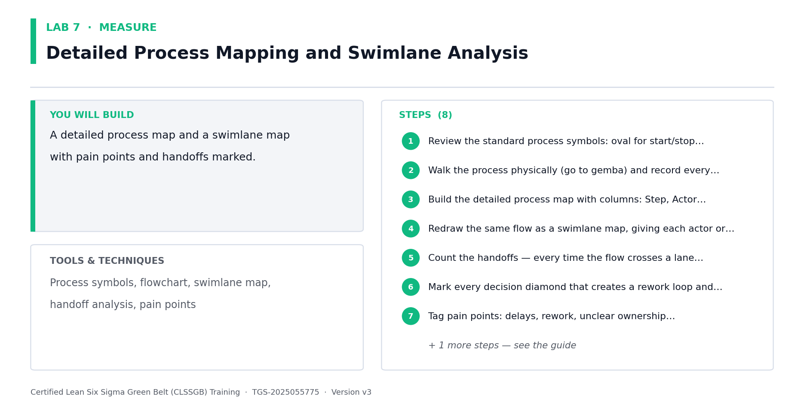

*Lab 7 at a glance — the deliverable, the tools and the steps.*

**Step-by-step**

1. List every stakeholder in your capstone: sponsor, process owner, operators, support functions, customers, finance, and anyone who can veto.
2. Build the RACI for your project — Responsible, Accountable, Consulted, Informed — and check there is exactly one Accountable per deliverable.
3. Plot each stakeholder on an influence (high/low) versus support (supportive/neutral/resistant) grid.
4. For every high-influence, low-support stakeholder, write a specific named action. 'Communicate more' is not an action.
5. Diagnose resistance type for each resistant stakeholder: technical (they doubt the solution), political (they lose something), or cultural (it conflicts with how things are done).
6. Match the response to the type — technical resistance needs evidence, political needs negotiation, cultural needs leadership modelling.
7. Build an ADKAR plan: how will you create Awareness, Desire, Knowledge, Ability and Reinforcement across the project life?
8. Write the communication plan: audience, message, channel, frequency and owner. Sponsors, operators and customers need different messages.
9. Identify the single stakeholder most likely to derail your capstone, and write your specific mitigation.

**Check your work**

Every stakeholder is plotted on the influence/support grid, every high-influence resistor has a named action matched to a diagnosed resistance type, and your ADKAR plan covers all five elements.

> **Note:** The full worksheet for this lab is in labs/lab-07-*.md.

---

## MEASURE — Measure at Black Belt Depth — Advanced Measurement Systems  (16%)

MSA recap · Attribute MSA & Kappa · Nested & destructive gauge studies · Capability for non-normal data · Sampling strategy

**Key concepts**

- Process mapping & VSM — in depth — Re-derive SIPOC, swimlane maps, value stream maps, takt time and the eight wastes in full.
- Data, sampling and sample size — in depth — Data types, operational definitions, sampling schemes and sample size formulas re-derived from first principles.
- Continuous Gage R&R — in depth — Full treatment of accuracy, repeatability, reproducibility, linearity, stability and %study variation.
- Yield, DPMO and capability — in depth — Classic yield, FPY, RTY, DPU, DPO, DPMO, sigma level and baseline Cp/Cpk, worked end to end.
- Attribute MSA — When the measurement is a judgement (pass/fail, grade), Gage R&R does not apply — attribute agreement does.
- Kappa analysis — Cohen's and Fleiss' Kappa quantify inspector agreement beyond chance. Kappa >= 0.75 is acceptable.
- Nested gauge studies — When parts cannot be measured twice by every operator, the crossed study is invalid — nest it.
- Destructive testing MSA — If measuring destroys the part, use near-identical part pairs and a nested design.
- Non-normal capability — Cp/Cpk assume normality. For non-normal data, transform (Box-Cox) or fit the correct distribution.
- Ppk vs Cpk — Cpk uses within-subgroup variation; Ppk uses total variation. Reporting the wrong one flatters the process.
- Sampling strategy at scale — Stratified and rational subgrouping decide what the control chart can even detect later.

### Lab 8 — Value Stream Mapping, Takt Time and the Eight Wastes — In Depth

Objective: Build a value stream map of your capstone process and quantify waste (A2, A4).

Goal: A full re-derivation of value stream mapping — material AND information flow, value-added ratio, takt time and the eight wastes — then applied to your own capstone process to expose where lead time is actually consumed. CAPSTONE BUILDING BLOCK — the output of this lab goes directly into your capstone project pack, which you present to the steering committee on Day 5.

**What you'll build**

A current-state VSM with a value-added ratio, takt time and a quantified waste log.   (Tools and techniques: VSM icons, material & information flow, lead time ladder, takt time, VA/NVA ratio, eight wastes.)

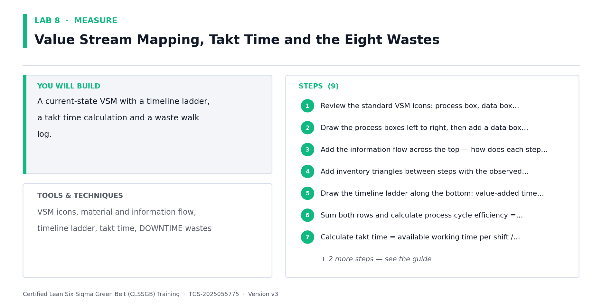

*Lab 8 at a glance — the deliverable, the tools and the steps.*

**Step-by-step**

1. Recap the VSM in full: what it shows that a process map does not — inventory, information flow, lead time and the push/pull signal.
2. Recap the standard VSM icons: process box, data box, inventory triangle, push arrow, supermarket, truck, information flow and the timeline ladder.
3. Map the current state of your capstone value stream from customer order to delivery. Include the information flow that triggers each step.
4. Populate each data box: cycle time, changeover time, uptime, batch size, number of operators and first-pass yield.
5. Draw the timeline ladder underneath. Put value-added time on the lower rung and waiting/queue time on the upper rung.
6. Calculate total lead time, total value-added time, and the value-added ratio (VA time / lead time). Most processes land under 5 percent.
7. Calculate takt time = available production time / customer demand for the period. Compare takt against each step's cycle time to find the bottleneck.
8. Recap the eight wastes in full (DOWNTIME: Defects, Overproduction, Waiting, Non-utilised talent, Transport, Inventory, Motion, Extra processing).
9. Walk your value stream and log every instance of each waste. Quantify each in time or money — an unquantified waste will not win funding.
10. Mark the three points on the VSM where the largest waste concentrates. These become improvement candidates for Day 4.

**Check your work**

Your VSM shows both material and information flow, you have calculated the value-added ratio and takt time from real numbers, and every logged waste carries a time or dollar quantification.

> **Note:** The full worksheet for this lab is in labs/lab-08-*.md.

---

### Lab 9 — Data Types, Operational Definitions and the Data Collection Plan

Objective: Build a rigorous data collection plan for your capstone (A4).

Goal: Re-derive data classification and operational definitions in full, then build the data collection plan that will feed every statistical test in Days 3 and 4. Bad data collected now cannot be rescued by clever statistics later. CAPSTONE BUILDING BLOCK — the output of this lab goes directly into your capstone project pack, which you present to the steering committee on Day 5.

**What you'll build**

A data collection plan with operational definitions for every metric in your capstone.   (Tools and techniques: Continuous vs discrete, nominal/ordinal/interval/ratio, operational definitions, data collection plan, stratification factors.)

*Lab 9 at a glance — the deliverable, the tools and the steps.*

**Step-by-step**

1. Recap the data hierarchy in full: nominal, ordinal, interval and ratio — and why the type determines which statistical test is legal.
2. Recap continuous versus discrete (attribute) data, and why continuous data needs far smaller samples to reach the same confidence.
3. List every metric your capstone requires: the project Y, each sub-Y from your flowdown, and each candidate X you intend to test.
4. Classify each metric by data type. Flag any metric currently collected as attribute that could be captured as continuous — convert it if you can.
5. Write a complete operational definition for each metric: what is measured, the instrument, the unit, the sampling point, the collector and the defect criterion.
6. Test each operational definition by having two people apply it independently to the same item. If they disagree, the definition is not yet operational.
7. Identify your stratification factors — plant, line, shift, operator, product family, supplier. You must capture these at collection time or you can never stratify later.
8. Build the data collection plan table: metric, definition, type, source, sample size, frequency, collector, stratification fields and start date.
9. Design the check sheet or data form. Make the easy path the correct path, or collectors will improvise.
10. Dry-run the plan on a small batch and fix whatever breaks before committing to full collection.

**Check your work**

Every capstone metric has a written operational definition that two people apply identically, stratification fields are captured at source, and the plan has survived a dry run.

> **Note:** The full worksheet for this lab is in labs/lab-09-*.md.

---

### Lab 10 — Sampling Strategy, Sample Size and Rational Subgrouping

Objective: Determine defensible sample sizes and design rational subgroups for your capstone (A4).

Goal: Re-derive sampling schemes and sample size formulas in full, then go beyond Green Belt with RATIONAL SUBGROUPING — the decision that silently determines what your control charts in Day 4 will be capable of detecting at all. CAPSTONE BUILDING BLOCK — the output of this lab goes directly into your capstone project pack, which you present to the steering committee on Day 5.

**What you'll build**

Calculated sample sizes for your capstone metrics and a rational subgrouping scheme.   (Tools and techniques: Random/stratified/systematic/cluster sampling, sample size for continuous & discrete data, rational subgrouping, sampling bias.)

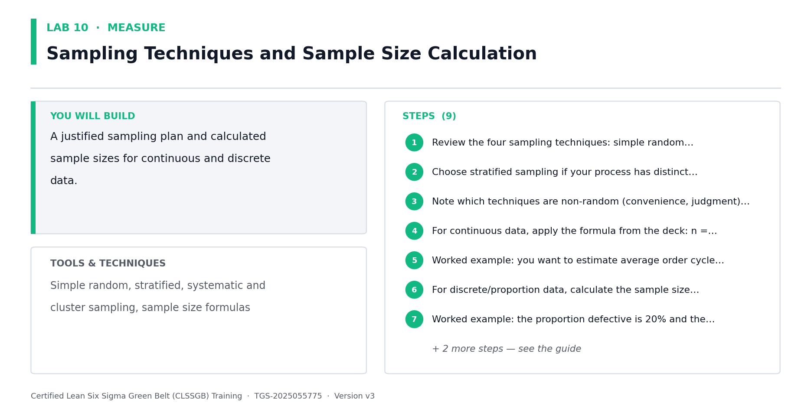

*Lab 10 at a glance — the deliverable, the tools and the steps.*

**Step-by-step**

1. Recap the four sampling schemes in full: simple random, stratified, systematic and cluster — with the failure mode of each.
2. Identify the sampling bias risks in your capstone: convenience sampling, day-shift-only sampling, and sampling only when the process is running well.
3. Recap the continuous-data sample size formula n = (1.96 s / d)^2, where s is the estimated standard deviation and d is the precision you require.
4. Apply it to your project Y. Estimate s from historical data or a pilot sample, choose your required precision d, and calculate n.
5. Recap the discrete-data formula n = (1.96/d)^2 x p(1-p), where p is the estimated proportion defective.
6. Apply it to your attribute metrics. Note how much larger n becomes — this is the cost of measuring in pass/fail.
7. Now design rational subgroups. A subgroup must contain only common-cause variation, so that between-subgroup variation shows up as a signal.
8. Decide what varies WITHIN your subgroup and what varies BETWEEN subgroups. Getting this backwards makes control limits so wide that nothing ever signals.
9. Set subgroup size and sampling frequency for your capstone Y, and state what shift size you would be able to detect.
10. Document the sampling plan and check it against the data collection plan from Lab 9 for consistency.

**Check your work**

Your sample sizes are calculated from a real estimate of s or p, your subgrouping scheme places common-cause variation within subgroups, and you can state the shift size your plan can detect.

> **Note:** The full worksheet for this lab is in labs/lab-10-*.md.

---

### Lab 11 — Continuous Gage R&R — In Depth

Objective: Validate a continuous measurement system for your capstone using Gage R&R (A4).

Goal: A full re-derivation of measurement system analysis for continuous data. Before any of the statistics in Days 3 and 4 can be trusted, the measurement system must be proven — an invalid gauge invalidates every conclusion that follows. CAPSTONE BUILDING BLOCK — the output of this lab goes directly into your capstone project pack, which you present to the steering committee on Day 5.

**What you'll build**

A completed crossed Gage R&R study with %study variation and ndc for your capstone metric.   (Tools and techniques: Accuracy, bias, linearity, stability, repeatability, reproducibility, %study variation, ndc, %tolerance.)

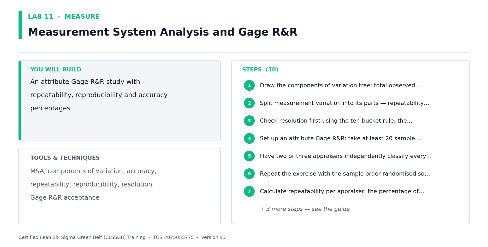

*Lab 11 at a glance — the deliverable, the tools and the steps.*

**Step-by-step**

1. Recap the components of measurement variation in full: observed variation = actual process variation + measurement system variation.
2. Recap the five MSA properties: accuracy (bias), linearity, stability, repeatability (equipment) and reproducibility (operator).
3. Distinguish repeatability from reproducibility precisely — same operator repeating, versus different operators on the same part.
4. Design a crossed Gage R&R for your capstone metric: 10 parts spanning the full process range, 3 operators, 3 repeat measurements each.
5. Select parts that span the real range of production. Parts clustered near the mean will flatter the gauge and hide its weakness.
6. Randomise the measurement order and blind the operators to previous readings, or you will measure memory rather than the gauge.
7. Run the study and record all 90 measurements in the standard crossed layout.
8. Calculate %study variation for repeatability, reproducibility and total Gage R&R. Apply the acceptance rule: under 10% acceptable, 10-30% marginal, over 30% unacceptable.
9. Calculate the number of distinct categories (ndc). ndc must be 5 or more for the gauge to distinguish parts usefully.
10. If the gauge fails, decide the fix: recalibrate, retrain operators, tighten the operational definition or replace the instrument. Then re-run.

**Check your work**

Your study uses parts spanning the full process range with randomised blinded order, and you have computed %study variation and ndc with a stated accept/reject decision.

> **Note:** The full worksheet for this lab is in labs/lab-11-*.md.

---

### Lab 12 — Attribute MSA and Kappa Analysis (Black Belt Only)

Objective: Validate a judgement-based measurement system using attribute agreement and Kappa (A4, K2).

Goal: BLACK BELT ONLY — the Green Belt course does not teach this. When the measurement is a human judgement (pass/fail, cosmetic grade, claim approve/reject), Gage R&R does not apply at all. Attribute agreement analysis and Cohen's/Fleiss' Kappa are the correct tools, and most organisations discover their inspectors agree far less than assumed. CAPSTONE BUILDING BLOCK — the output of this lab goes directly into your capstone project pack, which you present to the steering committee on Day 5.

**What you'll build**

An attribute agreement study with within-, between- and versus-standard Kappa values.   (Tools and techniques: Attribute agreement analysis, Cohen's Kappa, Fleiss' Kappa, within/between appraiser agreement, agreement vs standard.)

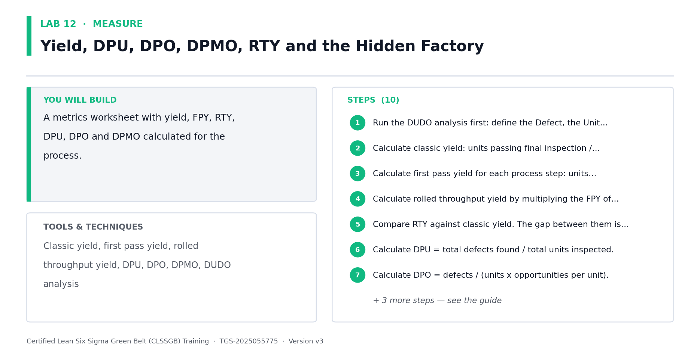

*Lab 12 at a glance — the deliverable, the tools and the steps.*

**Step-by-step**

1. Establish why Gage R&R fails for attribute data: there is no continuous scale on which to compute variance components.
2. Identify a judgement-based measurement in your capstone — visual inspection, cosmetic grading, document approval, claim adjudication or defect classification.
3. Select 30 to 50 sample items spanning clear-pass, clear-fail and deliberately borderline cases. Borderline items are where agreement actually breaks down.
4. Have an expert establish the KNOWN STANDARD (true) classification for every item. Without a standard you can measure consistency but never correctness.
5. Have 3 appraisers each classify every item twice, in randomised order, blinded to their own previous answer and to each other.
6. Calculate WITHIN-appraiser agreement — does each inspector agree with themselves? Self-disagreement is the most common and most ignored failure.
7. Calculate BETWEEN-appraiser agreement — do the inspectors agree with each other?
8. Calculate agreement VERSUS THE STANDARD — are they collectively correct, or consistently wrong together?
9. Compute Cohen's Kappa for appraiser pairs and Fleiss' Kappa across all appraisers. Kappa corrects raw agreement for agreement expected by chance.
10. Apply the acceptance rule: Kappa >= 0.90 excellent, 0.75-0.90 acceptable, below 0.75 requires action. Note that 90% raw agreement can still yield a poor Kappa.
11. Where agreement fails, prescribe the fix: boundary samples, photographic standards, tightened operational definitions or appraiser retraining. Then re-run.

**Check your work**

Your study includes borderline items and a known standard, you have computed within-appraiser, between-appraiser and versus-standard agreement plus Kappa, and you have an action plan for any Kappa below 0.75.

> **Note:** The full worksheet for this lab is in labs/lab-12-*.md.

---

### Lab 13 — Nested and Destructive Gauge Studies (Black Belt Only)

Objective: Design a valid MSA when parts cannot be measured repeatedly (A4, K2).

Goal: BLACK BELT ONLY. The crossed Gage R&R of Lab 11 assumes every operator can measure every part repeatedly. Destructive tests (tensile, burst, seal strength, chemical assay) break that assumption entirely — measuring consumes the part. The nested design is the correct answer, and using a crossed study here produces confident nonsense. CAPSTONE BUILDING BLOCK — the output of this lab goes directly into your capstone project pack, which you present to the steering committee on Day 5.

**What you'll build**

A nested gauge study design and analysis for a destructive or single-measurement test.   (Tools and techniques: Nested vs crossed designs, destructive testing MSA, homogeneous batches, part-to-part confounding, variance components.)

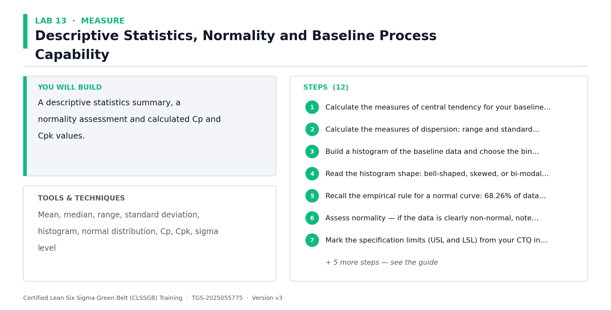

*Lab 13 at a glance — the deliverable, the tools and the steps.*

**Step-by-step**

1. State precisely why a crossed design is invalid for destructive tests: the part no longer exists to be measured a second time.
2. Identify a destructive or non-repeatable measurement in your capstone — or use the Meridian seal-strength test on infusion pump tubing.
3. Understand the nested design: each operator measures DIFFERENT parts, and parts are nested within batch rather than crossed with operator.
4. Establish homogeneous batches. The design assumes parts within a batch are effectively identical — if they are not, part variation contaminates repeatability.
5. Justify batch homogeneity: same lot, same machine, same setup, consecutive production, minimal elapsed time.
6. Design the study: 3 operators, 10 batches, 3 parts per operator per batch, all parts within a batch treated as replicates.
7. Run the study and record results in the nested layout — operator within batch, not operator crossed with part.
8. Compute variance components for repeatability and reproducibility using the nested model. Note that repeatability is now confounded with within-batch part variation.
9. State that confounding explicitly in your report. A nested study OVERSTATES repeatability variation, so it is a conservative test.
10. Decide accept/reject, and record the design choice and its rationale for the Day 5 presentation — expect this to be challenged.

**Check your work**

You can explain why a crossed study is invalid for your measurement, your batches are justified as homogeneous, and your report states the repeatability/part-variation confounding explicitly.

> **Note:** The full worksheet for this lab is in labs/lab-13-*.md.

---

### Lab 14 — Baseline Capability — Cp, Cpk, Pp, Ppk and Non-Normal Data

Objective: Establish baseline capability for your capstone, handling non-normal data correctly (A4, K2).

Goal: Re-derive capability analysis in full, then go beyond Green Belt: the distinction between Cpk and Ppk that most practitioners get wrong, and what to do when the data is not normal — which is most of the time in cycle-time and defect data. CAPSTONE BUILDING BLOCK — the output of this lab goes directly into your capstone project pack, which you present to the steering committee on Day 5.

**What you'll build**

A baseline capability study for your capstone Y with a documented normality decision.   (Tools and techniques: Cp, Cpk, Pp, Ppk, within vs overall variation, normality testing, Box-Cox transformation, non-normal capability.)

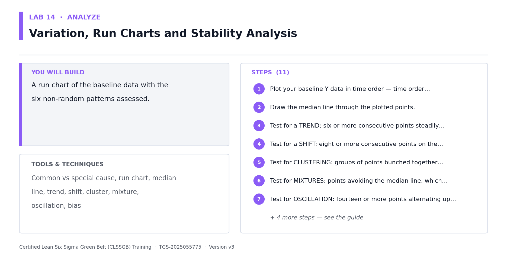

*Lab 14 at a glance — the deliverable, the tools and the steps.*

**Step-by-step**

1. Recap capability in full: Cp = (USL - LSL) / 6 sigma measures spread only; Cpk also accounts for centring and is always <= Cp.
2. Recap the acceptance benchmarks: Cpk >= 1.33 capable, >= 1.67 for critical characteristics, and the relationship between Cpk and sigma level.
3. Learn the distinction most practitioners get wrong: Cp/Cpk use WITHIN-subgroup (short-term) variation; Pp/Ppk use TOTAL (long-term) variation.
4. Understand the consequence: reporting Cpk on an unstable process flatters it, because between-subgroup drift is excluded from the estimate.
5. Establish the rule — the process must be STABLE before capability means anything. Check stability with a control chart first.
6. Test your capstone Y for normality using Anderson-Darling or Shapiro-Wilk. Read the p-value: p < 0.05 rejects normality.
7. Recognise that cycle time, waiting time and defect counts are routinely non-normal and usually right-skewed — this is expected, not an error.
8. For non-normal data, choose your route: apply a Box-Cox or Johnson transformation, or fit the correct distribution (Weibull, lognormal, exponential) directly.
9. Apply the transformation, re-test normality, then compute capability on the transformed scale — and report results in the ORIGINAL units.
10. Calculate both Cpk and Ppk for your capstone Y and explain the gap between them. A large gap means the process drifts between subgroups.
11. Record the baseline capability in your capstone pack alongside the Lab 3 sigma level.

**Check your work**

You have confirmed stability before computing capability, tested and documented normality with a p-value, handled non-normality by transformation or distribution fitting, and reported both Cpk and Ppk with an explanation of the gap.

> **Note:** The full worksheet for this lab is in labs/lab-14-*.md.

---

## ANALYZE — Analyze at Black Belt Depth — Advanced Statistical Analysis  (22%)

Hypothesis recap · Multiple regression · ANOVA · Non-parametric tests · Multi-vari studies · Model diagnostics

**Key concepts**

- Variation, run charts and Pareto — in depth — Common vs special cause, run chart patterns, stratification and Pareto analysis re-derived in full.
- Fishbone and 5 Whys — in depth — Cause-and-effect analysis by 5M+E, 5 Whys discipline and multi-voting — the tools you will coach Green Belts through.
- Hypothesis testing — in depth — H0/Ha formulation, alpha, p-values, confidence levels, test selection and Type I/II errors, worked thoroughly.
- Simple regression & correlation — in depth — Correlation coefficients, the regression line and the causation trap — the foundation multiple regression builds on.
- Multiple regression — Model Y against several Xs at once — the Green Belt's simple linear regression will not do here.
- Model diagnostics — R-squared adjusted, residual plots, multicollinearity (VIF) — a model that fits is not yet a model that is valid.
- ANOVA — Compare three or more group means in one test instead of inflating alpha with repeated t-tests.
- Two-way ANOVA & interactions — Two factors at once reveals interaction effects that one-factor-at-a-time analysis hides entirely.
- Non-parametric tests — Mann-Whitney, Kruskal-Wallis and Mood's median when the data will not meet normality assumptions.
- Multi-vari studies — Separate positional, cyclical and temporal variation before spending money hunting the wrong X.
- Chi-square & contingency — Test association between categorical variables — defect type against shift, line or supplier.
- From statistics to story — Translate a coefficient and a p-value into money, risk and a decision the sponsor can make.

### Lab 15 — Variation, Run Charts, Pareto and Stratification — In Depth

Objective: Separate common from special cause variation and stratify your capstone data (A3).

Goal: A full re-derivation of the foundation of all Six Sigma analysis: the distinction between common and special cause variation. Acting on common cause as if it were special (tampering) makes processes worse — this is the single most expensive mistake in process management. CAPSTONE BUILDING BLOCK — the output of this lab goes directly into your capstone project pack, which you present to the steering committee on Day 5.

**What you'll build**

A run chart with pattern analysis, a Pareto chart and a stratified defect analysis.   (Tools and techniques: Common vs special cause, run chart patterns, tampering, Pareto principle, stratification, boxplots.)

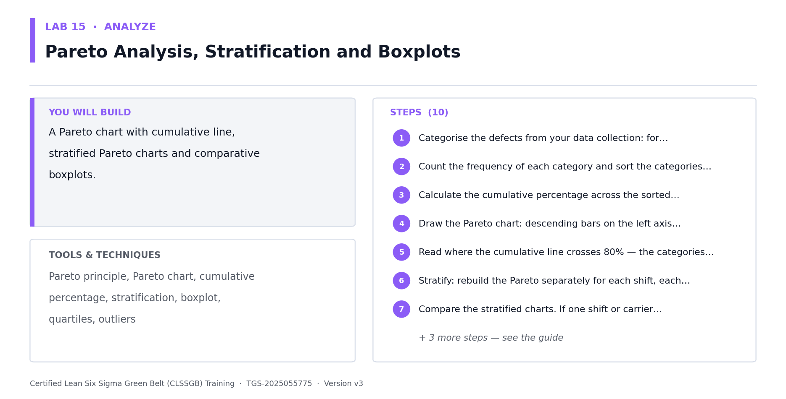

*Lab 15 at a glance — the deliverable, the tools and the steps.*

**Step-by-step**

1. Recap common versus special cause variation in full, with the management response each demands — process change versus local investigation.
2. Understand tampering (Deming's funnel): adjusting a stable process in response to common-cause noise increases variation. Demonstrate it with the bead or funnel experiment.
3. Plot your capstone Y as a run chart over time, with the median as the centre line.
4. Recap and apply the six run chart patterns in full: trend, shift, cluster, mixture, oscillation and bias — with the run rules that detect each.
5. Mark any special-cause signals and investigate what changed at that point in time. Special causes must be explained, not averaged away.
6. Recap the Pareto principle and build a Pareto chart of defect categories for your capstone, with the cumulative percentage line.
7. Identify the vital few categories accounting for roughly 80 percent of the impact. Weight by cost, not count, where defect costs differ materially.
8. Now stratify. Re-draw the Pareto separately by plant, line, shift, operator, product family and supplier.
9. Look for a stratification factor where the Pareto shape changes dramatically — that factor is a strong candidate X and tells you where to focus.
10. Build boxplots of your Y across each stratification factor to compare medians, spread and outliers visually before testing statistically.
11. Record your top three candidate Xs from stratification — these feed directly into the hypothesis tests in Lab 17.

**Check your work**

Your run chart is assessed against all six patterns, your Pareto is weighted appropriately, and stratification has produced at least three named candidate Xs for statistical testing.

> **Note:** The full worksheet for this lab is in labs/lab-15-*.md.

---

### Lab 16 — Fishbone, 5 Whys and Cause Prioritisation — In Depth

Objective: Generate and prioritise candidate root causes for your capstone (A3, K2).

Goal: Re-derive cause-and-effect analysis in full — to the depth at which you can facilitate it for a Green Belt team, which is a core Black Belt accountability. The output is a prioritised, testable cause list, not an unmanageable wall of sticky notes. CAPSTONE BUILDING BLOCK — the output of this lab goes directly into your capstone project pack, which you present to the steering committee on Day 5.

**What you'll build**

A fishbone diagram, 5 Whys chains and a prioritised list of testable candidate causes.   (Tools and techniques: Ishikawa 5M+E, brainstorming facilitation, 5 Whys, multi-voting, cause-and-effect matrix, hypothesis formulation.)

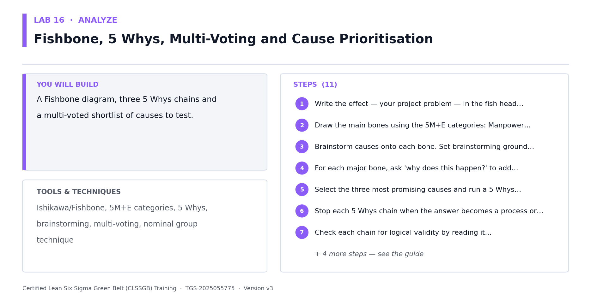

*Lab 16 at a glance — the deliverable, the tools and the steps.*

**Step-by-step**

1. Recap brainstorming facilitation in full: divergence before convergence, no criticism during generation, and how to stop the highest-paid opinion from dominating.
2. Recap the fishbone structure: the effect at the head, and 5M+E bones — Manpower, Method, Machine, Material, Measurement, Environment.
3. Write your capstone problem statement precisely at the head of the fishbone. A vague effect produces vague causes.
4. Facilitate the fishbone with your team, generating at least 25 candidate causes across all six bones. Thin bones signal blind spots, not absence of causes.
5. Recap the 5 Whys and its discipline: continue until the answer is a process or system failure, never a person to blame.
6. Apply 5 Whys to your top five fishbone causes. Note where a single chain branches — real causal chains are often trees, not lines.
7. Recap multi-voting and apply it to reduce your cause list to the ten most plausible candidates.
8. Build a cause-and-effect matrix: score each candidate cause against each CTQ, weighted by CTQ importance, to produce a ranked cause list.
9. Filter the ranked list for TESTABILITY — for each cause, can you state a hypothesis and obtain data? An untestable cause cannot be proven in Analyze.
10. Convert your top five testable causes into formal hypothesis statements ready for Lab 17.
11. Note how you would coach a Green Belt team through this session, and the two facilitation mistakes you would watch for.

**Check your work**

Your fishbone carries 25+ causes across all six bones, 5 Whys chains terminate at process rather than person, and you have five testable causes written as formal hypotheses.

> **Note:** The full worksheet for this lab is in labs/lab-16-*.md.

---

### Lab 17 — Hypothesis Testing — In Depth, With Test Selection

Objective: Test your capstone's candidate causes with correctly selected hypothesis tests (A3, K2).

Goal: A full re-derivation of hypothesis testing, including the test selection logic that Green Belts most often get wrong. You must be able to choose the right test, defend the choice, and explain the result in business language. CAPSTONE BUILDING BLOCK — the output of this lab goes directly into your capstone project pack, which you present to the steering committee on Day 5.

**What you'll build**

Completed hypothesis tests on your capstone's candidate causes with documented conclusions.   (Tools and techniques: H0/Ha, alpha, beta, power, p-values, t-tests, paired t, F-test, proportion tests, test selection logic.)

*Lab 17 at a glance — the deliverable, the tools and the steps.*

**Step-by-step**

1. Recap the logic of hypothesis testing in full: assume H0 (no difference), then ask how likely the observed data would be if H0 were true.
2. Recap H0 and Ha formulation. H0 always contains the equality; Ha carries the claim you are trying to establish.
3. Recap alpha, beta and power. Alpha is producer's risk (Type I, false alarm); beta is consumer's risk (Type II, missed signal); power = 1 - beta.
4. Understand the practical consequence: an underpowered test that fails to reject H0 has proven nothing. Check power before concluding 'no difference'.
5. Learn the test selection logic in full. Continuous Y: 1 sample vs target = 1-sample t; 2 independent groups = 2-sample t; paired = paired t; 3+ groups = ANOVA; variances = F-test or Levene.
6. Learn the discrete-Y branch: 1 proportion = 1-proportion test; 2 proportions = 2-proportion test; categorical association = chi-square.
7. Check the assumptions before every test: normality, independence and equal variance. A violated assumption invalidates the p-value entirely.
8. Take your five candidate causes from Lab 16 and select the correct test for each. Write down the justification for each selection.
9. State H0 and Ha for each test, set alpha (normally 0.05), and confirm you have adequate sample size and power.
10. Run each test and record the p-value. Apply the decision rule: p < alpha rejects H0.
11. Distinguish statistical from PRACTICAL significance. A p-value of 0.001 on a 0.2 percent improvement is real but worthless — always report effect size alongside p.
12. Build your rejected-causes log so nobody re-litigates cleared causes in Improve, and record confirmed causes in your capstone pack.

**Check your work**

Every test has a documented selection justification and assumption check, results report effect size alongside the p-value, and you maintain both a confirmed-cause and a rejected-cause log.

> **Note:** The full worksheet for this lab is in labs/lab-17-*.md.

---

### Lab 18 — Multiple Regression and Model Diagnostics (Black Belt Only)

Objective: Build and validate a multiple regression model of your capstone Y (A3, K2).

Goal: BLACK BELT ONLY — the Green Belt course teaches simple linear regression with one X. Real processes have several interacting Xs. Multiple regression models them together, but a model that fits is not yet a model that is valid, so the diagnostics matter as much as the coefficients. CAPSTONE BUILDING BLOCK — the output of this lab goes directly into your capstone project pack, which you present to the steering committee on Day 5.

**What you'll build**

A validated multiple regression model with full residual and multicollinearity diagnostics.   (Tools and techniques: Multiple regression, coefficients, adjusted R-squared, residual analysis, multicollinearity/VIF, model selection, overfitting.)

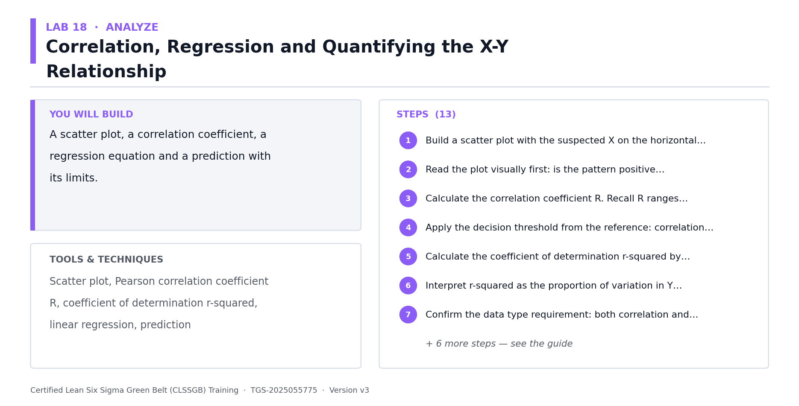

*Lab 18 at a glance — the deliverable, the tools and the steps.*

**Step-by-step**

1. Recap simple linear regression: the fitted line, slope interpretation, R-squared and the correlation-is-not-causation trap.
2. Extend to multiple regression: Y = b0 + b1X1 + b2X2 + ... + e, where each coefficient is the effect of that X holding all other Xs constant.
3. Understand why that 'holding constant' clause matters — it is what makes multiple regression fundamentally different from running several simple regressions.
4. Assemble your capstone dataset with the Y and at least four candidate Xs, with enough rows (a common rule of thumb is 10-15 observations per X).
5. Fit the full model and record the coefficients, their p-values, R-squared and adjusted R-squared.
6. Use ADJUSTED R-squared, not R-squared, to compare models. Plain R-squared always rises when you add an X, even a random one.
7. Check multicollinearity with Variance Inflation Factors. VIF > 5 is a concern, VIF > 10 is serious — correlated Xs make coefficients unstable and signs nonsensical.
8. Resolve multicollinearity by dropping or combining redundant Xs, then refit.
9. Run the residual diagnostics in full: residuals versus fitted values (should show no pattern), normal probability plot of residuals, and residuals versus order (independence).
10. Interpret residual patterns: a funnel shape indicates non-constant variance, curvature indicates a missing quadratic term, and drift over order indicates autocorrelation.
11. Reduce to the final model using backward elimination — drop the least significant X, refit, and repeat until all remaining Xs are significant.
12. Guard against overfitting: hold back a validation subset, or use cross-validation, and confirm the model predicts data it has not seen.
13. Translate the final model into business language: for each significant X, state what a one-unit change does to Y in customer or dollar terms.

**Check your work**

Your final model has all VIFs under 5, residual plots show no pattern, adjusted R-squared is reported, the model has been validated on held-out data, and each coefficient is stated in business terms.

> **Note:** The full worksheet for this lab is in labs/lab-18-*.md.

---

### Lab 19 — ANOVA, Interactions and Non-Parametric Tests (Black Belt Only)

Objective: Compare multiple groups using ANOVA and apply non-parametric alternatives (A3, K2).

Goal: BLACK BELT ONLY. Comparing three or more groups with repeated t-tests inflates the false-positive rate badly — ANOVA solves this. Two-way ANOVA then reveals interaction effects that one-factor analysis cannot see. And when normality fails, non-parametric tests are the correct answer rather than proceeding regardless. CAPSTONE BUILDING BLOCK — the output of this lab goes directly into your capstone project pack, which you present to the steering committee on Day 5.

**What you'll build**

One-way and two-way ANOVA on your capstone data plus a non-parametric confirmation.   (Tools and techniques: One-way ANOVA, F-statistic, post-hoc Tukey, two-way ANOVA, interaction effects, Mann-Whitney, Kruskal-Wallis, Mood's median.)

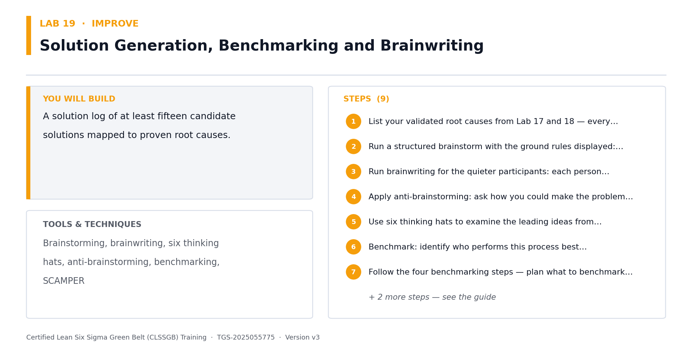

*Lab 19 at a glance — the deliverable, the tools and the steps.*

**Step-by-step**

1. Understand alpha inflation: comparing 4 groups pairwise needs 6 t-tests, and at alpha = 0.05 the family-wise false-positive risk rises to about 26 percent.
2. Recap one-way ANOVA: it partitions total variation into between-group and within-group components, and the F-statistic is their ratio.
3. State the ANOVA hypotheses: H0 is that all group means are equal; Ha is that at least one differs — ANOVA does not tell you which.
4. Check the ANOVA assumptions: normality of residuals, independence, and equal variances (test with Levene's or Bartlett's).
5. Run one-way ANOVA on a capstone factor with 3+ levels — plant, line, shift, product family or supplier.
6. If ANOVA is significant, run a post-hoc Tukey HSD to identify WHICH pairs differ, with the family-wise error rate controlled.
7. Extend to two-way ANOVA with two factors at once — for example plant AND shift on your capstone Y.
8. Read the interaction term. A significant interaction means the effect of one factor DEPENDS on the level of the other — for instance night shift hurts Suzhou but not Singapore.
9. Plot the interaction. Non-parallel lines indicate interaction; crossing lines indicate a strong one that invalidates any single-factor conclusion.
10. Understand why this matters for Improve: with a significant interaction, a fix that works at one plant may fail or backfire at another.
11. Now the non-parametric branch. When normality fails and transformation does not fix it, switch tests rather than ignoring the violation.
12. Map each test to its non-parametric equivalent: 2-sample t -> Mann-Whitney; one-way ANOVA -> Kruskal-Wallis; paired t -> Wilcoxon signed-rank; and Mood's median for heavy outliers.
13. Re-run one of your significant findings using its non-parametric equivalent. Agreement across both strengthens your Day 5 defence considerably.

**Check your work**

Your ANOVA assumptions are tested and documented, significant results carry a post-hoc analysis, you have interpreted an interaction plot, and at least one finding is confirmed non-parametrically.

> **Note:** The full worksheet for this lab is in labs/lab-19-*.md.

---

### Lab 20 — Multi-Vari Studies and Chi-Square Analysis (Black Belt Only)

Objective: Decompose variation by family using a multi-vari study and test categorical association (A3, K2).

Goal: BLACK BELT ONLY. Before spending money hunting a root cause, find out WHERE the variation actually lives. A multi-vari study separates positional, cyclical and temporal variation — and frequently reveals that the team has been investigating entirely the wrong family. CAPSTONE BUILDING BLOCK — the output of this lab goes directly into your capstone project pack, which you present to the steering committee on Day 5.

**What you'll build**

A multi-vari chart decomposing your capstone variation plus a chi-square association test.   (Tools and techniques: Multi-vari studies, positional/cyclical/temporal families, variation decomposition, chi-square, contingency tables, expected frequencies.)

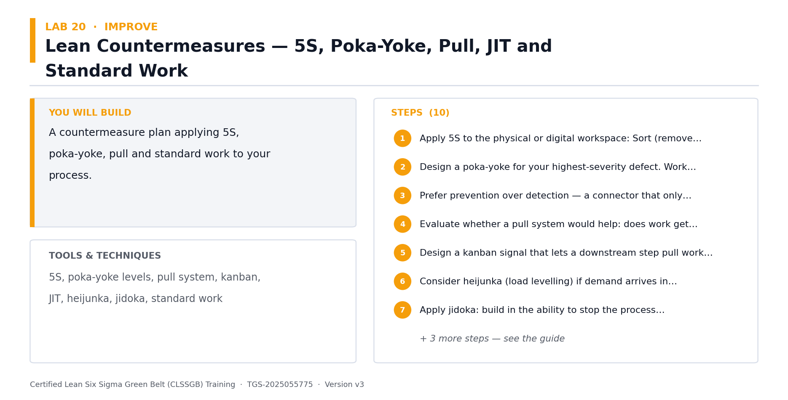

*Lab 20 at a glance — the deliverable, the tools and the steps.*

**Step-by-step**

1. Understand the three variation families. POSITIONAL: within a single unit or across positions in a machine. CYCLICAL: unit to unit, batch to batch. TEMPORAL: shift to shift, day to day.
2. Understand the payoff: if 70 percent of variation is positional, then investigating shift patterns is wasted effort no matter how thorough the investigation.
3. Design a multi-vari sampling plan for your capstone: sample multiple positions within units, consecutive units, and repeat across time periods.
4. Ensure the sampling captures all three families simultaneously — this is a nested sampling design, not three separate studies.
5. Collect the data and plot the multi-vari chart, with positional variation innermost and temporal outermost.
6. Read the chart: the family showing the largest vertical spread dominates. That is where your root cause investigation should concentrate.
7. Quantify the contribution of each family as a percentage of total variation using variance components.
8. Re-prioritise your candidate cause list from Lab 16 against the dominant variation family, and drop causes that belong to a family contributing little.
9. Now chi-square. Build a contingency table of two categorical variables from your capstone — defect type against shift, supplier or line.
10. Calculate expected frequencies under independence: expected = (row total x column total) / grand total.
11. Check the validity condition: all expected frequencies should be 5 or more, or the chi-square approximation breaks down and categories must be combined.
12. Compute the chi-square statistic and its p-value, and conclude whether defect type is associated with your categorical factor.
13. Translate a significant association into a testable process hypothesis — association is not causation, but it does tell you where to look.

**Check your work**

Your multi-vari chart captures all three families with quantified variance contributions, your cause list is re-prioritised against the dominant family, and your chi-square satisfies the expected-frequency condition.

> **Note:** The full worksheet for this lab is in labs/lab-20-*.md.

---

### Lab 21 — Analyze Tollgate — Proving Root Cause and Telling the Data Story

Objective: Consolidate your analysis into a defensible root cause conclusion (A3, K1).

Goal: The Analyze tollgate. Consolidate everything from Labs 15-20 into a proven root cause set, translate the statistics into business language, and rehearse the challenges you will face. Sponsors do not fund p-values; they fund decisions. CAPSTONE BUILDING BLOCK — the output of this lab goes directly into your capstone project pack, which you present to the steering committee on Day 5.

**What you'll build**

An Analyze tollgate pack with proven root causes, evidence and a business-language summary.   (Tools and techniques: Evidence consolidation, root cause validation, statistical-to-business translation, tollgate review, challenge preparation.)

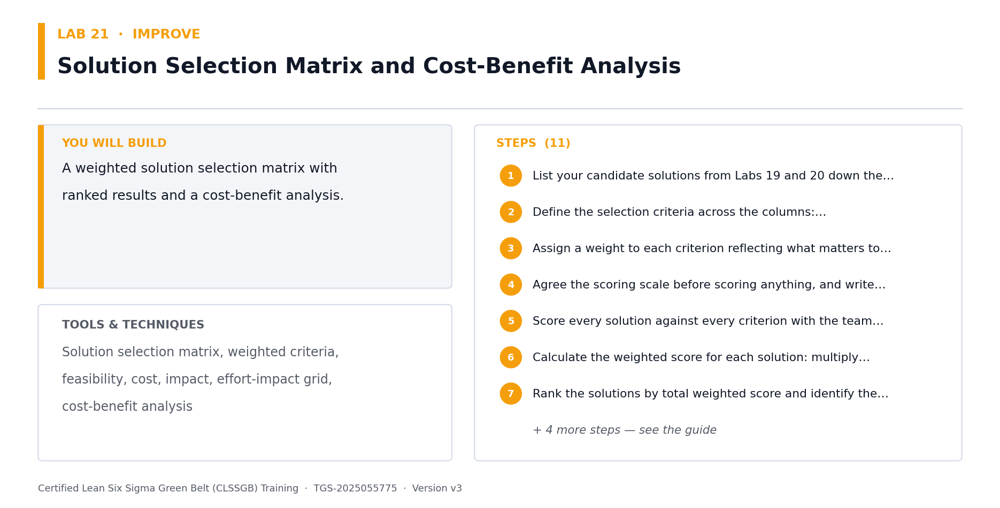

*Lab 21 at a glance — the deliverable, the tools and the steps.*

**Step-by-step**

1. Assemble every analytical result from Labs 15-20: stratification, hypothesis tests, regression model, ANOVA, multi-vari and chi-square.
2. For each candidate cause, record the verdict — PROVEN (statistically supported), REJECTED (tested and cleared) or UNTESTED (no data available).
3. Apply the triangulation rule: a root cause is strongest when supported by more than one independent method — for instance stratification plus a hypothesis test plus a regression coefficient.
4. Check each proven cause for practical significance. Quantify how much of the Y gap each explains, in percent and in dollars.
5. Rank your proven causes by the size of their contribution to the Y gap.
6. Confirm your causes are ACTIONABLE — a proven cause you cannot influence belongs in the risk register, not the improvement plan.
7. Translate each finding into one business sentence: 'Night shift at Suzhou runs 2.3 percentage points lower first-pass yield, costing about $180k annually.'
8. Build the tollgate pack: baseline, analysis method, proven causes, rejected causes, quantified impact and the recommendation to proceed.
9. Rehearse the challenges you should expect: was the sample adequate, were assumptions checked, could a confounding variable explain this, is the measurement system valid?
10. Prepare your evidence for each challenge — this is exactly what the Day 5 steering committee will probe.
11. Present the tollgate to a peer group and capture their challenges, then strengthen any weak points before Day 4.

**Check your work**

Every candidate cause carries a verdict, proven causes are triangulated across multiple methods and quantified in dollars, and you have rehearsed a prepared response to each expected challenge.

> **Note:** The full worksheet for this lab is in labs/lab-21-*.md.

---

## IMPROVE — Improve at Black Belt Depth — Design of Experiments  (18%)

Solution selection · Lean countermeasures · FMEA · Full & fractional factorial DOE · Confounding · RSM · Robust design

**Key concepts**

- Solution generation & selection — in depth — Brainstorming, brainwriting, benchmarking and weighted solution selection matrices, re-derived in full.
- Lean countermeasures — in depth — 5S, poka-yoke, pull, JIT, Heijunka, Jidoka and standard work — the Lean toolkit taught thoroughly.
- FMEA and RPN — in depth — Severity, Occurrence and Detection scoring, RPN calculation and the re-scored post-mitigation FMEA.
- Why DOE beats OFAT — One-factor-at-a-time misses interactions and wastes runs. DOE varies factors together, by design.
- Full factorial design — 2^k designs estimate every main effect and every interaction — the gold standard when runs are affordable.
- Main effects & interaction plots — Read the design: a non-parallel interaction plot means the effect of one X depends on another.
- Fractional factorial design — 2^(k-p) designs screen many factors in few runs by deliberately trading away high-order interactions.
- Confounding & resolution — Resolution III, IV and V describe exactly what you gave up. Know it before you interpret the result.
- Response surface methodology — Once the vital few Xs are known, RSM finds the optimum settings, not just the significant factors.
- Robust design (Taguchi) — Set the process so it performs well despite noise you cannot control — not just on average.
- Piloting and scale-up — Confirm the DOE optimum holds in production before rolling it out across sites.

### Lab 22 — Solution Generation, Selection and Lean Countermeasures — In Depth

Objective: Generate and select improvements targeting your proven root causes (A5).

Goal: Re-derive solution generation and the full Lean countermeasure toolkit, then select rigorously with a weighted matrix. Every solution must attack a PROVEN root cause from Lab 21 — solutions that address unproven causes are how projects quietly fail. CAPSTONE BUILDING BLOCK — the output of this lab goes directly into your capstone project pack, which you present to the steering committee on Day 5.

**What you'll build**

A scored solution selection matrix mapping each solution to a proven root cause.   (Tools and techniques: Brainstorming, brainwriting, SCAMPER, benchmarking, 5S, poka-yoke, pull/JIT, Heijunka, Jidoka, standard work, selection matrix.)

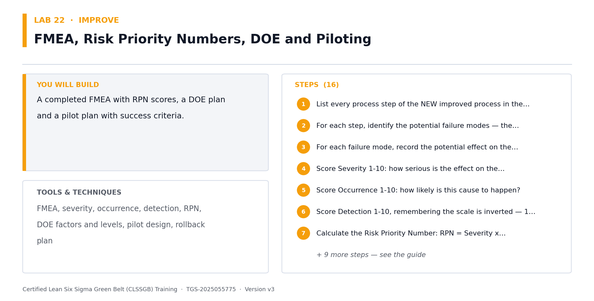

*Lab 22 at a glance — the deliverable, the tools and the steps.*

**Step-by-step**

1. Take your ranked proven root causes from Lab 21. Every solution generated in this lab must trace to one of them.
2. Recap divergent generation techniques in full: brainstorming, brainwriting (6-3-5), SCAMPER, anti-solution thinking and analogy from other industries.
3. Recap benchmarking and its four steps — plan, collect, analyse, adapt. Look outside your industry, where the best analogous processes usually are.
4. Generate at least three candidate solutions for each proven root cause. One solution per cause means you have not really explored the space.
5. Recap the Lean countermeasure toolkit in full: 5S, poka-yoke, pull systems, JIT, Heijunka (levelling), Jidoka (autonomation) and standard work.
6. Recap poka-yoke levels specifically: prevention (error impossible), detection (error caught immediately) and warning (error flagged). Always prefer prevention.
7. Map each Lean tool to the root causes in your capstone it could plausibly address, and generate at least two poka-yoke ideas.
8. Build the weighted solution selection matrix. Criteria typically: impact on Y, implementation cost, time to benefit, technical risk, ease of adoption and sustainability.
9. Weight the criteria with your sponsor, not alone — the weighting reflects business priorities that are theirs to set.
10. Score every candidate solution and compute weighted totals.
11. Sanity-check the top-ranked solutions: do they collectively address the causes explaining most of the Y gap? If not, revisit generation.
12. Identify which solutions have controllable factors suitable for DOE optimisation in Labs 23-25.

**Check your work**

Every solution traces to a proven root cause, criteria weights are agreed with the sponsor, and your selected set collectively addresses the majority of the quantified Y gap.

> **Note:** The full worksheet for this lab is in labs/lab-22-*.md.

---

### Lab 23 — Full Factorial Design of Experiments (Black Belt Only)

Objective: Design, run and analyse a full factorial experiment on your capstone process (A3, A5, K2).

Goal: BLACK BELT ONLY — the Green Belt course mentions DOE in passing; the Black Belt owns it. One-factor-at-a-time experimentation is slower, less informative and structurally incapable of detecting interactions. Full factorial designs estimate every main effect AND every interaction. CAPSTONE BUILDING BLOCK — the output of this lab goes directly into your capstone project pack, which you present to the steering committee on Day 5.

**What you'll build**

A designed 2^k full factorial experiment with main effects and interaction analysis.   (Tools and techniques: OFAT vs DOE, 2^k factorial, factors & levels, randomisation, replication, blocking, main effects, interaction plots, effect significance.)

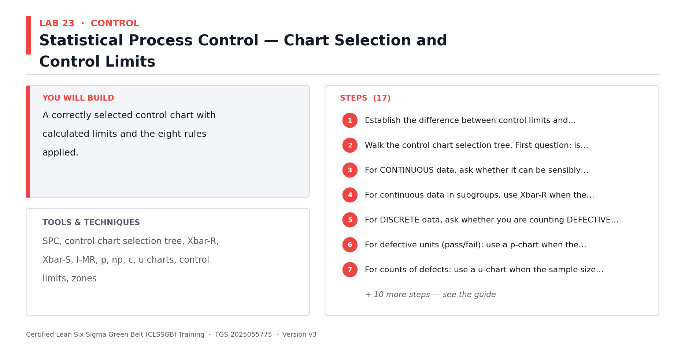

*Lab 23 at a glance — the deliverable, the tools and the steps.*

**Step-by-step**

1. Understand why OFAT fails: it cannot detect interactions at all, and it requires more runs for less information than a factorial design.
2. Recap the DOE vocabulary in full: factor, level, response, run, effect, interaction, replication, randomisation, blocking and experimental error.
3. Select 3 factors from your capstone that you can actually control and vary — temperature, speed, pressure, batch size, staffing level or method variant.
4. Set two levels for each factor — low (-1) and high (+1). Set them wide enough to produce a detectable effect but within safe operating limits.
5. Build the 2^3 design matrix: 8 runs covering every combination of the three factors, in standard order.
6. Decide replication. Replicates give an estimate of pure experimental error and let you test effect significance — 2 replicates gives 16 runs.
7. RANDOMISE the run order. Randomisation protects against unknown time-varying nuisance factors and is not optional.
8. Use blocking if runs must span shifts, days or material lots — block on the nuisance factor so it does not contaminate the effects.
9. Execute the experiment, holding all non-experimental factors constant and recording anything unexpected during each run.
10. Calculate main effects: the average response at the high level minus the average at the low level, for each factor.
11. Calculate interaction effects for AB, AC, BC and the three-way ABC.
12. Plot main effects (steeper slope means larger effect) and interaction plots (non-parallel lines mean interaction present).
13. Test effect significance using a Pareto of effects or a normal probability plot of effects — points off the line are real effects.
14. Build the prediction equation from the significant effects and identify the factor settings that optimise your Y.
15. Run confirmation trials at the predicted optimum. If the confirmation fails, the model is missing something — do not roll out.

**Check your work**

Your design is fully randomised with replication, you have computed and plotted both main effects and interactions, effect significance is assessed statistically, and confirmation runs validate the predicted optimum.

> **Note:** The full worksheet for this lab is in labs/lab-23-*.md.

---

### Lab 24 — Fractional Factorial Designs, Confounding and Resolution (Black Belt Only)

Objective: Screen many factors efficiently and interpret confounded effects correctly (A3, K2).

Goal: BLACK BELT ONLY. A full factorial on 7 factors needs 128 runs — usually unaffordable. Fractional factorials screen many factors in a fraction of the runs by deliberately trading away the ability to separate certain effects. The critical skill is knowing exactly WHAT you traded away, which is what resolution tells you. CAPSTONE BUILDING BLOCK — the output of this lab goes directly into your capstone project pack, which you present to the steering committee on Day 5.

**What you'll build**

A fractional factorial screening design with a documented confounding structure.   (Tools and techniques: 2^(k-p) designs, generators, defining relation, alias structure, confounding, Resolution III/IV/V, screening, fold-over designs.)

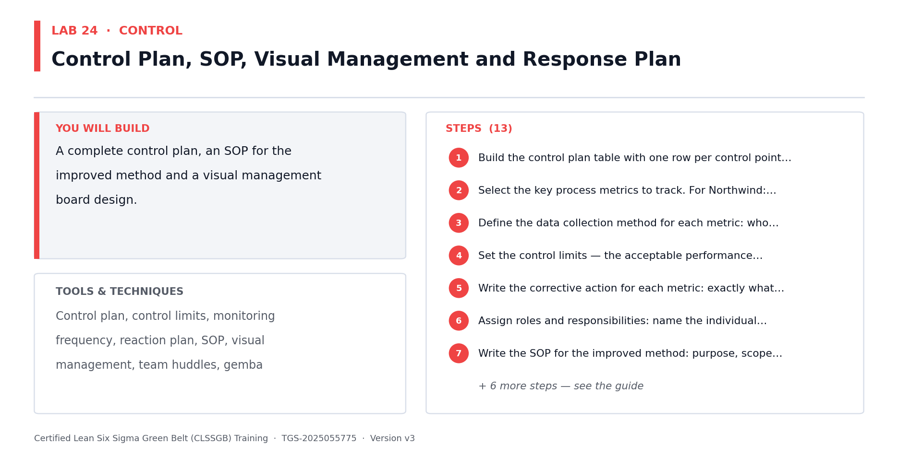

*Lab 24 at a glance — the deliverable, the tools and the steps.*

**Step-by-step**

1. Understand the economics: 2^7 full factorial = 128 runs; a 2^(7-4) fractional = 16 runs. The saving is real but it is paid for in resolving power.
2. Understand confounding (aliasing): in a fractional design, some effects are mathematically indistinguishable from others.
3. Learn the generator and defining relation — the algebra that determines exactly which effects are aliased with which.
4. Learn the resolution scale precisely. RESOLUTION III: main effects aliased with two-factor interactions. RESOLUTION IV: main effects clear of two-factor interactions, but two-factor interactions aliased with each other. RESOLUTION V: main effects and two-factor interactions all clear.
5. Understand the selection rule: use Resolution III only for early screening of many factors; use IV or V when you intend to interpret interactions.
6. Select 5 or more candidate factors from your capstone for a screening experiment.
7. Choose your fraction based on your run budget, and write down the resulting resolution BEFORE running anything.
8. Generate the design matrix and write out the complete alias structure. You must be able to state what each estimated effect is confounded with.
9. Apply effect sparsity and hierarchy: usually few factors dominate, and low-order effects are more likely to be real than high-order ones.
10. Randomise and execute the screening experiment.
11. Analyse the effects and identify the vital few factors. Where an important effect is confounded, state the ambiguity explicitly rather than assuming the main effect is the real one.
12. Resolve critical ambiguity with a fold-over design — a second fraction that de-aliases the effects you care about.
13. Take the screened vital few factors forward to a full factorial or RSM study in Lab 25.

**Check your work**

You stated the design resolution before running, wrote out the complete alias structure, and any ambiguous conclusion is either declared explicitly or resolved by a fold-over.

> **Note:** The full worksheet for this lab is in labs/lab-24-*.md.

---

### Lab 25 — Response Surface Methodology and Robust Design (Black Belt Only)

Objective: Optimise factor settings using RSM and make the process robust to noise (A5, K2).

Goal: BLACK BELT ONLY. Factorial designs find WHICH factors matter; RSM finds the OPTIMUM SETTINGS by modelling curvature that a two-level design cannot see. Taguchi robust design then goes further — setting the process so it performs consistently despite noise you cannot control. CAPSTONE BUILDING BLOCK — the output of this lab goes directly into your capstone project pack, which you present to the steering committee on Day 5.

**What you'll build**

An RSM study locating optimal settings plus a robust design analysis against noise factors.   (Tools and techniques: Curvature & centre points, steepest ascent, central composite design, Box-Behnken, contour & surface plots, Taguchi, signal-to-noise, control vs noise factors.)

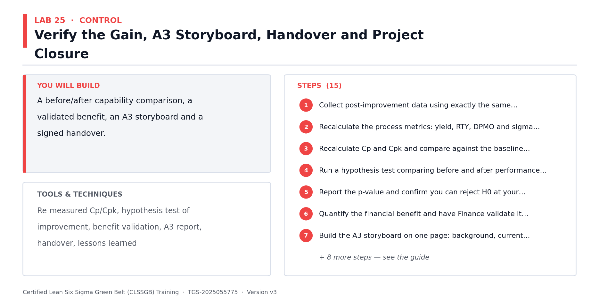

*Lab 25 at a glance — the deliverable, the tools and the steps.*

**Step-by-step**

1. Understand the limitation of 2-level designs: with only two levels per factor they fit a straight line and cannot detect curvature at all.
2. Add CENTRE POINTS to your factorial design to test for curvature. A significant centre-point effect means the true response is curved and a linear model will mislead you.
3. If no curvature is present and you are far from the optimum, use steepest ascent — move the factor settings in the direction of greatest improvement and re-experiment.
4. Once curvature appears, you are near the optimum and need a second-order design.
5. Learn the central composite design (CCD): a factorial core, plus centre points, plus axial (star) points that add the third level needed to estimate quadratic terms.
6. Learn the Box-Behnken alternative: fewer runs than CCD and it never requires extreme corner combinations, which matters when corners are unsafe or infeasible.
7. Design and run an RSM study on the 2-3 vital factors from Lab 24.
8. Fit the second-order model including linear, quadratic and interaction terms.
9. Generate contour and 3D surface plots to visualise the response surface and locate the optimum region.
10. Find the stationary point and classify it — maximum, minimum or saddle. A saddle point means the optimum lies at a boundary, not in the middle.
11. Use desirability functions if you must optimise several responses at once with competing optima.
12. Now robust design. Separate your factors into CONTROL factors (you set them) and NOISE factors (ambient conditions, material variation, operator, wear).
13. Understand the Taguchi insight: choose control factor settings at which the response is LEAST SENSITIVE to noise — a slightly lower mean with far less variation usually wins.
14. Compute the signal-to-noise ratio for candidate settings, using the correct form for your objective (smaller-is-better, larger-is-better or nominal-is-best).
15. Select the robust operating window and run confirmation trials under deliberately varied noise conditions.

**Check your work**

Curvature is tested with centre points, your second-order model is visualised as a contour or surface plot with a classified stationary point, and the robust settings are confirmed under varied noise conditions.

> **Note:** The full worksheet for this lab is in labs/lab-25-*.md.

---

### Lab 26 — FMEA, Pilot Design and Implementation Planning — In Depth

Objective: De-risk and pilot your capstone improvement before full rollout (A5).

Goal: Re-derive FMEA in full, then design the pilot that proves your improvement works before it is scaled. A Black Belt never rolls out an unpiloted change across sites — the cost of being wrong at scale is exactly what the pilot buys down. CAPSTONE BUILDING BLOCK — the output of this lab goes directly into your capstone project pack, which you present to the steering committee on Day 5.

**What you'll build**

A completed FMEA with re-scored RPNs and a full pilot plan with success criteria.   (Tools and techniques: FMEA, severity/occurrence/detection, RPN, risk mitigation, pilot design, success criteria, implementation planning, cost-benefit.)

**Step-by-step**

1. Recap FMEA in full: failure mode, effect, cause, current controls, and the three ratings that combine into the risk priority number.
2. Recap the scoring scales precisely: Severity (impact if it occurs), Occurrence (likelihood) and Detection (probability of catching it BEFORE the customer does — note the inverted scale).
3. Build the FMEA for your selected improvement. For each process step, ask what could fail, what happens if it does, and what would cause it.
4. Score S, O and D on 1-10 scales and calculate RPN = S x O x D.
5. Apply the severity override rule: any failure mode with Severity 9-10 requires action regardless of how low its RPN is.
6. Rank by RPN and define mitigation for every high-RPN mode, targeting the component you can most cheaply move — usually Detection, sometimes Occurrence.
7. RE-SCORE after mitigation and record the residual RPN. An FMEA without re-scoring has not demonstrated that risk was actually reduced.
8. Design the pilot: scope (which line, site or segment), duration, sample size and the exact data to be collected.
9. Define quantitative success criteria BEFORE the pilot starts, expressed against your Lab 3 baseline. Criteria defined afterwards get rationalised.
10. Plan the comparison: before/after, or better, a control group running the unchanged process concurrently to rule out external effects.
11. Define the stop conditions — what result would cause you to halt the pilot rather than push through.
12. Build the implementation plan: tasks, owners, dates, training, communication, systems changes and documentation updates.
13. Complete the cost-benefit analysis: implementation cost, annualised benefit, payback period and NPV where the investment is material.
14. Run the pilot (or design it fully for post-course execution) and test the results statistically against the baseline — a visual improvement is not proof.

**Check your work**

Your FMEA is re-scored post-mitigation with the severity override applied, pilot success criteria were defined before starting, and the improvement is tested statistically against the documented baseline.

> **Note:** The full worksheet for this lab is in labs/lab-26-*.md.

---

## CONTROL — Control at Black Belt Depth — Advanced SPC & Sustaining  (12%)

SPC recap · CUSUM · EWMA · Short-run charts · Multivariate SPC · Control plan governance · Financial validation · Handover

**Key concepts**

- SPC and control charts — in depth — Chart anatomy, control limits, chart selection (Xbar-R, Xbar-S, I-MR, p, np, c, u) and out-of-control rules, in full.
- Capability and control plans — in depth — Cp, Cpk, Pp, Ppk, control limits vs specification limits, control plans, SOPs and response plans re-derived.
- Limits of Shewhart charts — Shewhart charts are slow to detect small sustained shifts — which is exactly what a drifting process does.
- CUSUM charts — Cumulative sum charts accumulate small deviations, detecting a sustained 1-sigma shift far faster.
- EWMA charts — Exponentially weighted moving average — tunable memory, strong for small shifts and autocorrelated data.
- Short-run SPC — High-mix low-volume processes never gather 25 subgroups per part. Standardise and chart across parts.
- Multivariate SPC — When several correlated characteristics matter, Hotelling's T-squared beats several separate charts.
- Control plan governance — The Black Belt audits control plans across the portfolio — not just their own project.
- Financial benefits validation — Benefits are not real until Finance signs them. Hard, soft and cost-avoidance are booked differently.
- Handover and closure — Transfer to the process owner, verify sustained performance, then formally close and harvest the lessons.

### Lab 27 — Statistical Process Control and Chart Selection — In Depth

Objective: Select and construct the correct control chart for your capstone Y (A5, K1).

Goal: A full re-derivation of SPC — chart anatomy, the selection logic, control limits and the out-of-control rules. You must be able to teach this to Green Belts and audit their chart choices, which is a core Black Belt accountability. CAPSTONE BUILDING BLOCK — the output of this lab goes directly into your capstone project pack, which you present to the steering committee on Day 5.

**What you'll build**

A correctly selected and constructed control chart for your capstone Y with applied run rules.   (Tools and techniques: Chart anatomy, control limits, Xbar-R, Xbar-S, I-MR, p, np, c, u charts, Western Electric rules, control vs spec limits.)

**Step-by-step**

1. Recap SPC purpose in full: distinguish signal from noise over time, so drift is caught before it becomes a defect.
2. Recap chart anatomy: centre line, upper and lower control limits at +/- 3 sigma, and why 3 sigma balances false alarms against missed signals.
3. Establish the critical distinction: CONTROL limits come from the process's own voice (the data); SPECIFICATION limits come from the customer. They are unrelated and must never be drawn on the same axis as if comparable.
4. Learn the chart selection logic in full. Continuous data: subgroup size 1 = I-MR; 2-8 = Xbar-R; 9+ = Xbar-S.
5. Learn the attribute branch: defectives with constant sample size = np; varying = p. Defects with constant opportunity = c; varying = u.
6. Select the correct chart for your capstone Y and write down the justification. Selecting the wrong chart produces wrong limits and false confidence.
7. Collect at least 25 subgroups of baseline data — fewer gives control limits too unstable to be trustworthy.
8. Calculate the control limits using the correct constants (A2, D3, D4 for Xbar-R; equivalent constants for other charts).
9. Plot the chart and apply the Western Electric run rules in full: 1 point beyond 3 sigma; 2 of 3 beyond 2 sigma; 4 of 5 beyond 1 sigma; 8 consecutive on one side; trends; and hugging the centre line.
10. Investigate every signal. If a special cause is found and removed, recalculate the limits excluding that point — but only with a documented assignable cause.
11. Confirm the process is stable before proceeding. An unstable process has no meaningful capability and cannot be controlled by a control plan alone.

**Check your work**

Your chart selection is justified against the selection logic, limits are computed from 25+ subgroups with the correct constants, and all run rules are applied with every signal investigated.

> **Note:** The full worksheet for this lab is in labs/lab-27-*.md.

---

### Lab 28 — CUSUM, EWMA and Short-Run SPC (Black Belt Only)

Objective: Detect small sustained shifts using CUSUM and EWMA, and chart high-mix processes (A5, K2).

Goal: BLACK BELT ONLY. Shewhart charts are poor at detecting small sustained shifts — they may take dozens of subgroups to react to a 1-sigma drift, which is precisely how a process degrades unnoticed after a project closes. CUSUM and EWMA solve this, and short-run methods handle high-mix low-volume processes Shewhart cannot chart at all. CAPSTONE BUILDING BLOCK — the output of this lab goes directly into your capstone project pack, which you present to the steering committee on Day 5.

**What you'll build**

CUSUM and EWMA charts on your capstone data plus a short-run standardised chart.   (Tools and techniques: ARL, CUSUM, decision interval, V-mask, EWMA, lambda weighting, autocorrelation, short-run standardised charts, DNOM.)

**Step-by-step**

1. Understand Average Run Length (ARL): the expected number of subgroups before a chart signals. For a 1-sigma shift, a Shewhart Xbar chart has an ARL around 44 — far too slow.
2. Understand the structural reason: a Shewhart chart considers only the CURRENT point and has no memory of the recent past.
3. Learn CUSUM: it accumulates deviations from target, so a small persistent bias adds up into a detectable signal rather than being repeatedly dismissed as noise.
4. Set up the CUSUM parameters: the reference value k (typically half the shift you want to detect) and the decision interval h (typically 4 or 5 sigma).
5. Build upper and lower CUSUM statistics for your capstone data and plot them against the decision interval.
6. Compare the CUSUM detection point against the Shewhart chart from Lab 27 on the same data — CUSUM typically detects a sustained small shift several subgroups sooner.
7. Learn EWMA: each point is a weighted average of all history, with weights decaying geometrically. Lambda controls the memory.
8. Choose lambda deliberately: small lambda (0.1-0.2) gives long memory and strong small-shift detection; large lambda (0.4+) approaches Shewhart behaviour.
9. Build the EWMA chart with its widening initial control limits, and note that EWMA also handles autocorrelated data far better than Shewhart.
10. Test your capstone data for autocorrelation. Chemical, batch and continuous-flow processes are frequently autocorrelated, which makes Shewhart limits far too narrow and generates constant false alarms.
11. Now short-run SPC. Understand the problem: high-mix low-volume processes never accumulate 25 subgroups of any single part number.
12. Learn the deviation-from-nominal (DNOM) approach: plot (measurement - part nominal) so different part numbers share one chart.
13. Learn the standardised approach for parts with differing variances: plot (measurement - nominal) / sigma_part, putting all parts on a common scale.
14. Build a short-run chart for a multi-product step in your capstone, or for Meridian's shared assembly line across pump variants.
15. Decide which chart type belongs in your capstone control plan and justify the choice against shift size, autocorrelation and product mix.

**Check your work**

You have built CUSUM and EWMA charts and compared their detection speed against Shewhart on the same data, tested for autocorrelation, and justified your final chart selection for the control plan.

> **Note:** The full worksheet for this lab is in labs/lab-28-*.md.

---

### Lab 29 — Multivariate SPC and Control Plan Governance (Black Belt Only)

Objective: Monitor correlated characteristics with Hotelling's T-squared and govern control plans (A5, K1).

Goal: BLACK BELT ONLY. When several correlated characteristics matter, running separate charts inflates false alarms and — more dangerously — misses failures visible only in the correlation structure. Then step up to the portfolio view: the Black Belt audits control plans across projects, not just their own. CAPSTONE BUILDING BLOCK — the output of this lab goes directly into your capstone project pack, which you present to the steering committee on Day 5.

**What you'll build**

A Hotelling T-squared chart plus a governed control plan for your capstone.   (Tools and techniques: Multivariate SPC, Hotelling T-squared, correlation structure, false alarm inflation, control plan, response plan, audit cadence.)

**Step-by-step**

1. Understand the false alarm problem: 5 separate charts each at alpha = 0.0027 gives a combined false alarm rate over 1.3 percent — five times intended.
2. Understand the more serious failure: two characteristics can each sit within their own limits while their COMBINATION is impossible, and separate charts will never see it.
3. Identify a set of correlated characteristics in your capstone — dimensions on one part, or related cycle times across linked steps.
4. Compute the correlation matrix and confirm the characteristics are genuinely correlated. If they are independent, separate charts are fine.
5. Learn Hotelling's T-squared: it collapses several correlated characteristics into one statistic accounting for the covariance structure.
6. Build the T-squared chart with its upper control limit from the F-distribution, and note there is no lower limit — T-squared is always positive.
7. Understand the interpretation difficulty: a T-squared signal tells you something is wrong but not which variable. Use decomposition or individual charts as a follow-up diagnostic.
8. Now build your capstone control plan in full: for each critical X and the Y — the metric, target, specification, measurement method, sample size, frequency, chart type, owner and reaction plan.
9. Write the reaction plan for each metric as a specific instruction: containment action, escalation path, named owner and time limit. 'Investigate' is not a reaction plan.
10. Add the control plan to the process documentation and update the SOP, training material and visual management boards.
11. Step up to portfolio governance: as Black Belt you audit control plans across multiple projects. Define your audit cadence and criteria.
12. Define what a control plan audit checks: is the chart still being maintained, are signals being actioned, is the owner still in post, and has the process drifted since handover?
13. Identify the most common decay mode — charts maintained but signals never actioned — and write your countermeasure for it.

**Check your work**

Your correlated characteristics are confirmed by a correlation matrix before applying T-squared, every control plan metric has a specific named reaction plan, and you have defined an audit cadence with explicit criteria.

> **Note:** The full worksheet for this lab is in labs/lab-29-*.md.

---

### Lab 30 — Financial Benefits Validation, Handover and Project Closure

Objective: Validate benefits with Finance and formally close your capstone project (A5, K1).

Goal: Benefits are not real until Finance signs them. This lab converts your improvement into a validated financial number, transfers ownership to the process owner, and formally closes the project — the step most often skipped, and the reason gains quietly evaporate. CAPSTONE BUILDING BLOCK — the output of this lab goes directly into your capstone project pack, which you present to the steering committee on Day 5.

**What you'll build**

A Finance-validated benefits statement and a signed handover and closure pack.   (Tools and techniques: Hard vs soft benefits, cost avoidance, benefit validation, Finance sign-off, handover, sustainability audit, lessons learned, closure.)

**Step-by-step**

1. Learn the benefit categories precisely. HARD: cost reduction that appears in the P&L. SOFT: capacity or time released without a headcount or cost change. COST AVOIDANCE: costs not incurred that would have been.
2. Understand why the distinction matters: Finance books these differently, and claiming soft benefits as hard is the fastest way to lose credibility with a CFO.
3. Quantify your capstone's benefit against the Lab 3 baseline, using post-improvement data over a defensible period, not a single good week.
4. Verify the improvement is statistically significant, not a favourable run — apply a hypothesis test comparing post-improvement against baseline.
5. Confirm sustained performance with your control chart: the shift must hold for a meaningful period before the benefit can be booked.
6. Separate your benefit into hard, soft and cost-avoidance components and state each explicitly.
7. Take the calculation to Finance and obtain sign-off. Expect challenge on the baseline period, the attribution and whether other changes could explain the result.
8. Prepare your attribution argument: what else changed in the period, and why the improvement is attributable to your intervention rather than to those.
9. Build the handover pack: control plan, updated SOPs, training records, control charts, reaction plans and the named process owner.
10. Conduct the handover meeting with the process owner. They must accept ownership explicitly — an assumed handover is a failed handover.
11. Schedule the sustainability audit at 30, 60 and 90 days post-handover, with a named auditor and defined criteria.
12. Run the lessons learned session: what worked, what did not, what you would do differently, and what transfers to the Green Belts you mentor.
13. Formally close the project with sponsor sign-off, and archive the full DMAIC storyboard.
14. Update the project portfolio from Lab 2 — record the closed project's realised benefit and select the next project.

**Check your work**

Your benefit is separated into hard, soft and cost-avoidance components, validated statistically and signed off by Finance, and the process owner has explicitly accepted handover with a scheduled sustainability audit.

> **Note:** The full worksheet for this lab is in labs/lab-30-*.md.

---

## CAPSTONE — Capstone Project & Steering Committee Presentation  (10%)

A3 storyboard · Consolidating your DMAIC artifacts · Presenting to sponsors · Defending the analysis · Programme leadership

**Key concepts**

- The A3 storyboard — One page tells the whole project: background, current state, analysis, countermeasures, results, next steps.
- Consolidating your artifacts — Every lab from Day 1 produced one piece of your capstone — now assemble them into one narrative.
- Telling the data story — Lead with the business impact, support it with the statistics — never the other way round.
- Presenting to a steering committee — Sponsors want the decision, the risk and the money in the first two minutes.
- Defending the analysis — Expect challenge on sample size, assumptions and confounding — prepare the evidence for each.
- Handover and sustainability — Show who owns the process now, how it is monitored, and what triggers escalation.
- Lessons learned — Harvest what transfers to the next project and to the Green Belts you will mentor.
- Your Black Belt journey — Certification, project logging, mentoring obligations and continuing practice.

### Lab 31 — Consolidating Your Capstone — The A3 Storyboard

Objective: Consolidate all DMAIC artifacts from Labs 1-30 into a single A3 storyboard (A1-A5, K1).

Goal: You have been building this project since Lab 1. Now assemble thirty labs' worth of artifacts into ONE page that tells the whole story. The A3 discipline is deliberately constraining — if it does not fit on one page, you do not yet understand which parts matter.

**What you'll build**

A complete A3 storyboard covering your full DMAIC project on a single page.   (Tools and techniques: A3 thinking, storyboard structure, artifact selection, visual summary, narrative flow.)

**Step-by-step**

1. Retrieve every artifact you have produced since Lab 1 and lay them out in DMAIC order. You should have thirty or more pieces.
2. Learn the A3 structure: Background, Current State, Goal, Root Cause Analysis, Countermeasures, Results, and Follow-up Actions.
3. Write the Background in three sentences: the business context and why this project was selected from the portfolio.
4. Present the Current State using your baseline — sigma level, capability, run chart and the quantified COPQ from Lab 1.
5. State the Goal exactly as chartered, with the SMART target and the deadline.
6. Summarise Root Cause Analysis with your strongest evidence only — the Pareto or stratification, the key hypothesis test result and the regression or ANOVA finding.
7. Present Countermeasures: the selected solutions, the DOE optimum settings and the FMEA-driven risk mitigations.
8. Present Results: before/after comparison, the statistical significance test, the control chart showing sustained performance, and the Finance-validated benefit.
9. List Follow-up Actions: the control plan owner, audit schedule, open risks and the next project in the portfolio.
10. Now edit ruthlessly to one page. Every element must earn its place — cut anything that does not change the reader's understanding or decision.
11. Apply the visual test: a sponsor should grasp the whole story in 60 seconds from the charts alone, without reading the text.
12. Have a peer read your A3 cold and tell you what the project did. If they get it wrong, the A3 is not yet finished.

**Check your work**

Your A3 fits on one page, covers all seven sections, carries your real project data throughout, and a peer reading it cold can correctly summarise the project.

> **Note:** The full worksheet for this lab is in labs/lab-31-*.md.

---

### Lab 32 — Building the Steering Committee Presentation

Objective: Build a presentation that leads with business impact and defends the analysis (A1-A5).

Goal: Sponsors are not statisticians. They want the decision, the money and the risk in the first two minutes, with the statistics available underneath as supporting evidence. This lab builds the deck you will deliver and defend in Lab 33.

**What you'll build**

A 15-minute steering committee presentation with an appendix of supporting analysis.   (Tools and techniques: Executive communication, data storytelling, chart selection, structuring for decisions, appendix strategy.)

**Step-by-step**

1. Understand your audience: the sponsor wants the business outcome; the process owner wants the operational change; Finance wants the benefit validated.
2. Open with the headline: what the project achieved, what it is worth annually, and what decision you need from the committee.
3. Apply the two-minute rule — if the committee stopped you after two minutes, they should already have everything needed to make a decision.
4. Structure the main body against DMAIC, but at business altitude: the problem, what the data showed, what you changed, what resulted.
5. Select your charts carefully. One before/after comparison, one root cause chart, one control chart showing sustained gain. Resist showing everything you built.
6. Design each chart for a projector at the back of a room: large fonts, direct labels, no unexplained jargon and no default spreadsheet styling.
7. State the statistics in business language. 'The difference is statistically significant (p = 0.003)' beats a table of test output.
8. Present the benefit precisely: hard, soft and cost avoidance separated, with the Finance sign-off named explicitly.
9. Present the risks honestly, along with their mitigations. A presentation with no risks reads as naive and invites harder challenge.
10. Close with the specific ask: approve the rollout, release resources, or approve the next project in the portfolio.
11. Build the APPENDIX with your full analysis — regression output, ANOVA tables, DOE design and alias structure, MSA study and control plan. This is where challenges get answered.
12. Rehearse to time. Fifteen minutes means fifteen minutes; overrunning signals you cannot prioritise.

**Check your work**

Your presentation delivers the decision, benefit and ask within the first two minutes, charts are projector-legible, statistics are stated in business language, and every likely challenge has an appendix slide behind it.

> **Note:** The full worksheet for this lab is in labs/lab-32-*.md.

---

### Lab 33 — Capstone Presentation and Defence

Objective: Present and defend your capstone project to a simulated steering committee (A1-A5, K1, K2).

Goal: The capstone assessment. Present your project to a simulated steering committee of peers and the trainer, then defend the analysis under challenge. Defending your methodology under pressure is the skill that separates a Black Belt from a Green Belt.

**What you'll build**

A delivered 15-minute presentation with a defended Q&A session.   (Tools and techniques: Presentation delivery, handling challenge, methodological defence, peer assessment, professional judgement.)

**Step-by-step**

1. Deliver your 15-minute presentation to the steering committee panel.
2. Hold the two-minute rule under pressure — lead with outcome, benefit and ask.
3. Take questions. Expect challenge on sample adequacy: was your sample size justified, and what power did your tests have?
4. Expect challenge on the measurement system: how do you know the data is trustworthy? Have your Gage R&R or Kappa result ready.
5. Expect challenge on assumptions: did you test normality, equal variance and independence, and what did you do when they failed?
6. Expect challenge on confounding: what else changed during the period, and how do you know your intervention caused the improvement?
7. Expect challenge on DOE: what was your design resolution, what effects were aliased, and did confirmation runs validate the optimum?
8. Expect challenge on sustainability: what stops this from decaying in six months once attention moves elsewhere?
9. Expect challenge on the benefit: is it hard or soft, who in Finance validated it, and over what period?
10. Answer with evidence, not assertion. Go to your appendix. Where you do not know, say so and state how you would find out — this is far stronger than bluffing.
11. Where a challenge reveals a genuine weakness, acknowledge it and state the mitigation. Defensiveness costs more credibility than the weakness itself.
12. Observe the other presentations and record challenges you had not anticipated for your own project.

**Check your work**

You delivered within time, answered challenges with evidence from your appendix rather than assertion, and acknowledged genuine weaknesses with a stated mitigation.

> **Note:** The full worksheet for this lab is in labs/lab-33-*.md.

---

### Lab 34 — Lessons Learned, Mentoring Green Belts and Your Black Belt Journey

Objective: Harvest lessons, plan your mentoring practice and map your continuing development (K1).

Goal: Close the course as you would close a project. Harvest what transfers, then turn to the accountability that most defines the role: mentoring Green Belts. A Black Belt is measured not only by their own projects but by the belts they develop.

**What you'll build**

A lessons-learned record, a Green Belt mentoring plan and a personal development roadmap.   (Tools and techniques: Lessons learned, knowledge transfer, mentoring model, coaching questions, certification pathway, continuing practice.)

**Step-by-step**

1. Run your own lessons learned: what worked in your capstone, what did not, and what you would do differently next time.
2. Separate lessons that are project-specific from those that transfer to any project. Only the transferable ones belong in the organisational knowledge base.
3. Record the two analytical techniques from this course you found most difficult, and plan how you will build fluency in them.
4. Now the mentoring role. Understand the core principle: a Black Belt coaches Green Belts through their analysis rather than performing it for them.
5. Learn the coaching question set: what does your data show, what have you ruled out, what assumption is that resting on, and how would you know if you were wrong?
6. Identify where Green Belts most commonly need intervention — scope creep, wrong test selection, confusing correlation with causation, and skipping MSA entirely.
7. Plan your tollgate review approach: what evidence you require at each gate before allowing a Green Belt project to proceed.
8. Decide when to intervene directly versus letting a Green Belt learn from a recoverable mistake. Both have costs.
9. Draft a mentoring plan for one Green Belt in your organisation: their project, their development gaps, your review cadence.
10. Map your certification pathway: project logging requirements, the certification body's criteria and any remaining evidence you need.
11. Identify your next portfolio project from the Lab 2 map, and set a start date.
12. Write your 90-day plan: complete or hand over the capstone, begin mentoring, and select the next project.

**Check your work**

Your lessons are separated into project-specific and transferable, you have a named Green Belt mentoring plan with a review cadence, and your 90-day plan has dated commitments.

> **Note:** The full worksheet for this lab is in labs/lab-34-*.md.

---

## Quick Reference — Formulas You Should Know

**Process performance metrics**

- Yield = (Good units / Total units) x 100
- DPU (Defects Per Unit) = Defects / Units
- DPO (Defects Per Opportunity) = Defects / (Units x Opportunities per unit)
- DPMO (Defects Per Million Opportunities) = DPO x 1,000,000
- First Pass Yield (FPY) = units passing with no rework / total units started
- Rolled Throughput Yield (RTY) = FPY(step 1) x FPY(step 2) x ... x FPY(step n)
- Process Cycle Efficiency = Value-added time / Total lead time
- Takt time = Available working time / Customer demand

**Sigma level reference**

- 1 sigma — 690,000 DPMO (about 31% yield)
- 2 sigma — 308,000 DPMO (about 69% yield)
- 3 sigma — 66,800 DPMO (about 93.3% yield)
- 4 sigma — 6,210 DPMO (about 99.38% yield)
- 5 sigma — 233 DPMO (about 99.977% yield)
- 6 sigma — 3.4 DPMO (about 99.99966% yield)

## Quick Reference — The Eight Wastes (DOWNTIME)

- D — Defects: output that fails the requirement and must be corrected or redone.
- O — Overproduction: producing more, or earlier, than the customer needs.
- W — Waiting: work or people idle, waiting for the next step, an approval or information.
- N — Non-utilised talent: skills and ideas of people not being used.
- T — Transport: unnecessary movement of materials, work items or information between places.
- I — Inventory: work in progress, backlogs and queues sitting between steps.
- M — Motion: unnecessary movement of people, or switching between systems and screens.
- E — Extra-processing: doing more work to the output than the customer requires or values.

## Preparing for the Assessment

- Capstone Project Report — the consolidated DMAIC storyboard built across Days 1-4 (K1, K2).
- Capstone Presentation — a 15-minute steering committee presentation and defence (A1-A5).
- There is NO practice exam and NO written or practical assessment paper in this course.
- Your capstone IS the assessment — it is built from the artifacts you produce in Labs 1 to 30.
- Open book: you may use these slides, this Learner Guide and your own project data throughout.
- Consolidate your artifacts into a ONE-PAGE A3 storyboard: Background, Current State, Goal, Root Cause, Countermeasures, Results, Follow-up.
- Lead your presentation with the decision, the benefit and the ask — the sponsor needs those in the first two minutes.
- Prepare an APPENDIX with your full analysis; this is where challenge questions get answered with evidence.
- Be ready to defend your sample size and the statistical power of your tests.
- Be ready to prove your measurement system is valid — Gage R&R for continuous data, Kappa for attribute data.
- Be ready to state which assumptions you tested (normality, equal variance, independence) and what you did when they failed.
- Be ready to answer a confounding challenge: what else changed, and why is the gain attributable to your intervention?
- Be ready to state your DOE resolution and exactly which effects were aliased.
- Be ready to separate hard, soft and cost-avoidance benefits, and name who in Finance validated them.
- Be ready to explain what stops the improvement decaying once attention moves elsewhere.
- Where a challenge exposes a genuine weakness, acknowledge it and state the mitigation — that is stronger than defending it.
- A minimum of 75% attendance is required to be eligible for assessment and funding.

## Glossary

- **Lean** — A method to maximise customer value by systematically identifying and removing waste.
- **Six Sigma** — A data-driven method to reduce variation and defects; the target is 3.4 defects per million opportunities.
- **Lean Six Sigma** — The combined method — Lean improves speed and flow, Six Sigma improves consistency and accuracy.
- **DMAIC** — Define, Measure, Analyze, Improve, Control — the Six Sigma improvement roadmap.
- **PDCA** — Plan, Do, Check, Act — a lighter improvement cycle used for small, fast improvements.
- **VOC** — Voice of the Customer — customer needs and expectations expressed in the customer's own words.
- **CTQ** — Critical to Quality — a specific, measurable requirement translated from a VOC statement.
- **SIPOC** — Suppliers, Inputs, Process, Outputs, Customers — the macro 'as-is' process map.
- **Muda** — The Japanese term for waste — any activity that consumes resource but creates no customer value.
- **DOWNTIME** — Mnemonic for the eight wastes: Defects, Overproduction, Waiting, Non-utilised talent, Transport, Inventory, Motion, Extra-processing.
- **Value-added (VA)** — An activity the customer would be willing to pay for because it changes the product or service.
- **Non-value-added (NVA)** — An activity that consumes resource but adds nothing the customer values — pure waste.
- **Defect** — An output that fails to meet the CTQ requirement.
- **Common cause variation** — Natural, always-present variation built into the process; addressed by changing the process.
- **Special cause variation** — Unusual variation traceable to a specific assignable event; addressed by investigating that event.
- **Pareto principle** — The 80/20 rule — roughly 80% of effects come from 20% of causes.
- **Run chart** — A plot of a metric over time, used to spot trend, shift, cluster and oscillation patterns.
- **5 Whys** — Repeatedly asking 'why' to drill from a symptom down to an actionable root cause.
- **Fishbone (Ishikawa) diagram** — A cause-and-effect diagram organising candidate causes into categories such as the 5Ms.
- **5M categories** — Manpower, Method, Machine, Material, Measurement — standard Fishbone categories.
- **Multi-voting** — A team technique to narrow a long list of candidate causes to an agreed shortlist.
- **DPU / DPO / DPMO** — Defects per unit / per opportunity / per million opportunities — standard defect-rate metrics.
- **Yield** — The percentage of output produced without defects.
- **RTY** — Rolled Throughput Yield — the probability a unit passes through every process step with no rework.
- **Sigma level** — A common yardstick for process performance, derived from DPMO.
- **COPQ** — Cost of Poor Quality — the internal failure, external failure, appraisal and prevention costs of defects.
- **5S** — Sort, Set in order, Shine, Standardise, Sustain — a Lean method for organising the workplace.
- **Poka-Yoke** — Mistake proofing — designing the process so an error is difficult or impossible to make.
- **Standard work** — The documented current best-known method for performing a task.
- **Kaizen** — Continuous improvement through many small changes, made by everyone.
- **Takt time** — Available working time divided by customer demand — the pace the process must run to meet demand.
- **Control plan** — The document naming the metric, target, monitoring method, frequency, owner and reaction plan.
- **Specification limits (LSL/USL)** — The acceptable limits set by the customer; outside them is a defect.
- **Control limits (LCL/UCL)** — Limits calculated from the process itself, typically the mean plus/minus three standard deviations.
- **SPC** — Statistical Process Control — monitoring a process over time to predict and prevent problems.
- **A3** — A one-page report telling the whole improvement story from background through to follow-up.
- **Gemba** — 'The real place' — going to where the work actually happens to observe the process directly.
