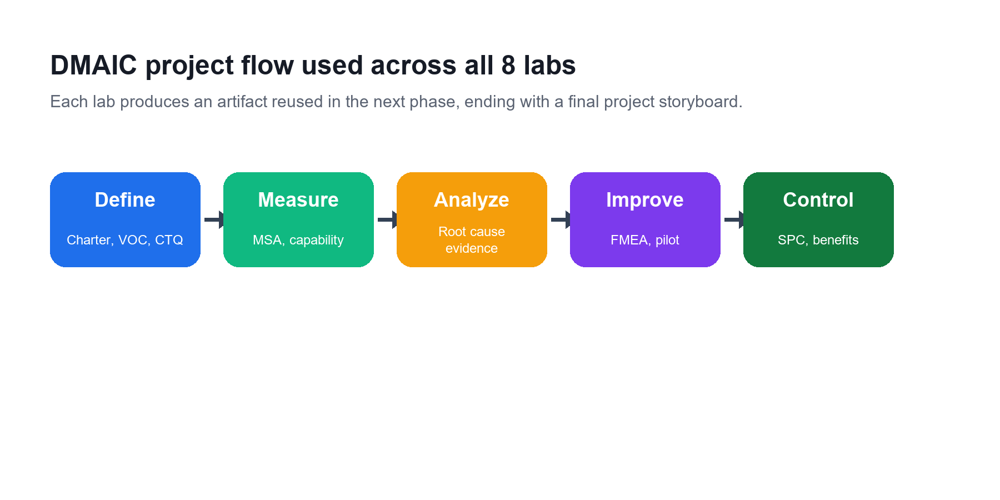
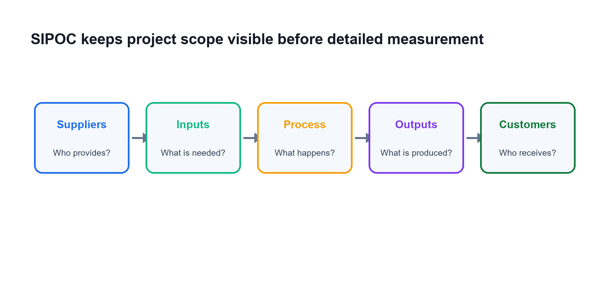
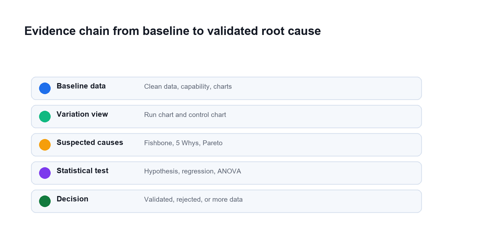
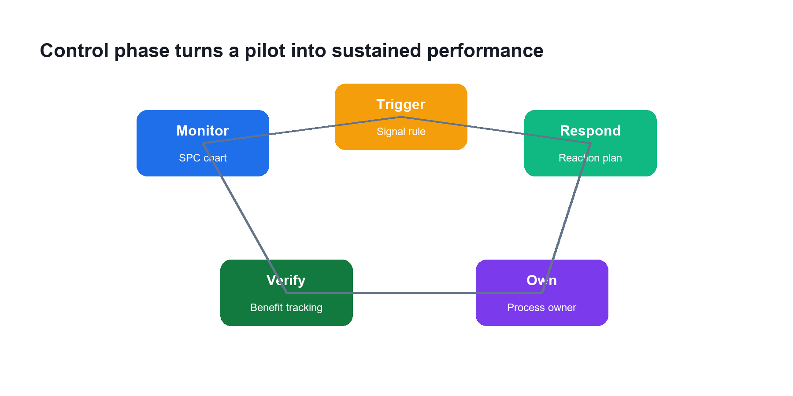

# Learner Guide - Certified Lean Six Sigma Black Belt (CLSSBB) Training

**Course Code:** TGS-2024051900  
**Version:** 1.0  
**Provider:** Tertiary Infotech Academy Pte Ltd

## Course Overview

This learner guide mirrors the DOCX Learner Guide and is aligned to all eight labs in the CLSSBB lab repository.

## DMAIC Lab Roadmap

| Phase | Labs | Main Artifacts | Decision Gate |
| --- | --- | --- | --- |
| Define | 01-02 | Charter, VOC, CTQ tree, SIPOC, process map | Scope is clear and CTQs are measurable |
| Measure | 03-04 | Data plan, MSA notes, capability worksheet, baseline charts | Data can be trusted and baseline variation is understood |
| Analyze | 05-06 | Fishbone, 5 Whys, Pareto, tests, regression/ANOVA/DOE plan | Root causes are validated with evidence |
| Improve | 07 | Solution matrix, FMEA, pilot plan | Selected solutions address proven causes and pilot risk is controlled |
| Control | 08 | Control plan, SPC plan, benefits tracker, storyboard | Process owner can sustain and respond to drift |

## Step-by-Step Lab Guides

### Lab 01 - Project Charter, VOC, and CTQ Tree

Source lab: `labs/lab-01-project-charter-voc-ctq.md`

#### Objectives

- Select a Black Belt project scenario.
- Build a project charter.
- Capture voice of customer.
- Translate VOC into measurable CTQs.

#### Step-by-Step Instructions

1. Select a process problem from your workplace or use a trainer-provided scenario.
2. Write a one-paragraph business case.
3. Write the problem statement using current performance facts.
4. Avoid including assumed causes in the problem statement.
5. Write a SMART goal statement.
6. Define in-scope and out-of-scope boundaries.
7. Identify sponsor, process owner, team members, customers, and affected departments.
8. Create a basic RACI table.
9. Collect at least five VOC statements from complaints, interviews, surveys, audits, or support records.
10. Convert each VOC statement into a customer need.
11. Build a CTQ tree with need, driver, CTQ metric, target, and defect definition.
12. Review the charter with another learner and remove vague language.

#### Validation

- The problem statement includes measurable current performance.
- The goal statement has target and timeline.
- Each CTQ can be measured.
- Scope boundaries are clear enough to prevent project drift.

#### Deliverables

- Project charter.
- RACI table.
- VOC table.
- CTQ tree.

#### Review Questions

1. Why should a problem statement avoid assumed causes?
2. What makes a CTQ measurable?
3. How does project scope protect the team?
4. What is the Black Belt's role in stakeholder alignment?

#### Scenario

You have been assigned to lead a process improvement project. Before collecting data, you must define the business problem, scope, customers, and measurable success criteria.

### Lab 02 - SIPOC, Process Map, and Waste Analysis

Source lab: `labs/lab-02-sipoc-process-map-waste-analysis.md`

#### Objectives

- Build a SIPOC.
- Map the current-state process.
- Identify handoffs, queues, rework, and waste.
- Refine the project scope.

#### Step-by-Step Instructions

1. Write the process start event and end event.
2. List the main customers and outputs.
3. List the major process steps between start and end.
4. List key inputs and suppliers.
5. Build a SIPOC table.
6. Create a high-level process map with 6 to 10 steps.
7. Add decision points and rework loops.
8. Mark handoffs between people, teams, or systems.
9. Mark waiting points or queues.
10. Classify steps as value-added, business-value-added, or non-value-added.
11. Identify examples of defects, overproduction, waiting, non-used talent, transport, inventory, motion, and extra processing.
12. Update scope notes if the map reveals unclear boundaries.
13. Identify where baseline data should be collected.

#### Validation

- The SIPOC matches the project scope.
- The process map is understandable to someone outside the team.
- Waste examples are linked to actual steps.
- Data collection points are identified.

#### Deliverables

- SIPOC.
- Current-state process map.
- Waste analysis table.
- Updated scope notes.

#### Review Questions

1. Why is SIPOC useful before detailed process mapping?
2. What is the difference between value-added and business-value-added work?
3. How can process maps reveal hidden rework?
4. Why should data collection points be chosen after mapping?

#### Scenario

The project charter defines the problem, but the team needs a shared view of the process before measuring performance. You will map the current process and identify where waste may exist.

### Lab 03 - Data Collection, MSA, and Process Capability

Source lab: `labs/lab-03-data-collection-msa-capability.md`

#### Objectives

- Create a data collection plan.
- Define units, defects, and opportunities.
- Assess measurement system risks.
- Calculate baseline process performance.

#### Step-by-Step Instructions

1. Select the primary Y metric from the CTQ tree.
2. Write an operational definition for the metric.
3. Define unit, defect, opportunity, target, and specification limits if available.
4. Choose sampling period, sample size, data source, and data owner.
5. Build a data collection plan.
6. Identify possible data quality risks.
7. For continuous measurements, outline a Gage R&R study.
8. For judgment-based attribute data, outline an attribute agreement study.
9. Collect or use sample baseline data.
10. Calculate DPU and DPMO if defect data is available.
11. Calculate first pass yield and rolled throughput yield if step yield data is available.
12. Calculate mean, standard deviation, Cp, and Cpk if continuous data and specification limits are available.
13. Document whether the baseline is trustworthy enough to continue.

#### Validation

- The metric has an operational definition.
- Data collection responsibility is assigned.
- Measurement risks are documented.
- Capability calculations match the data type.

#### Deliverables

- Data collection plan.
- Operational definition.
- MSA risk notes.
- Capability worksheet.

#### Review Questions

1. Why can poor measurement systems invalidate a project?
2. When would you use DPMO instead of Cp/Cpk?
3. What is the difference between short-term and long-term capability?
4. Why must specification limits come from customer or business requirements?

#### Scenario

The team needs trustworthy baseline data. You must define the metric carefully, check whether measurement is reliable, and calculate current process capability.

### Lab 04 - Baseline Analysis and Control Charts

Source lab: `labs/lab-04-baseline-analysis-control-charts.md`

#### Objectives

- Summarize baseline data.
- Create visual analysis charts.
- Select appropriate control charts.
- Interpret stability and variation.

#### Step-by-Step Instructions

1. Import baseline data into a spreadsheet.
2. Check for missing values, duplicates, and obvious data entry errors.
3. Calculate count, mean, median, standard deviation, minimum, maximum, and range.
4. Create a histogram.
5. Create a time series or run chart.
6. Annotate known events that may explain changes.
7. Select a control chart based on data type and subgrouping.
8. Use an I-MR chart for individual continuous observations where appropriate.
9. Use Xbar-R or Xbar-S charts for subgrouped continuous data where appropriate.
10. Use p, np, c, or u charts for attribute data where appropriate.
11. Plot center line and control limits.
12. Identify possible special cause signals.
13. Decide whether the process is stable enough for capability analysis and root cause testing.

#### Validation

- Descriptive statistics are calculated correctly.
- The chart type matches the data.
- Special cause signals are clearly marked.
- The baseline interpretation separates average performance from variation.

#### Deliverables

- Descriptive statistics table.
- Histogram.
- Run chart or time series plot.
- Control chart.
- Baseline interpretation.

#### Review Questions

1. Why should stability be checked before capability claims?
2. What is common cause variation?
3. What is special cause variation?
4. How does chart selection depend on data type?

#### Scenario

Before searching for root causes, the team must understand baseline variation. A process that is unstable should not be summarized only by averages.

### Lab 05 - Root Cause Analysis and Hypothesis Testing

Source lab: `labs/lab-05-root-cause-hypothesis-testing.md`

#### Objectives

- Generate possible root causes.
- Prioritize causes using data.
- Select appropriate hypothesis tests.
- Interpret statistical and practical significance.

#### Step-by-Step Instructions

1. Create a fishbone diagram for the project problem.
2. Use categories such as people, process, equipment, material, measurement, environment, and management.
3. Select at least two likely causes and apply 5 Whys.
4. Create a Pareto chart if category defect data is available.
5. Translate suspected causes into testable hypotheses.
6. Identify the Y data type and X data type.
7. Check whether samples are paired or independent.
8. Check whether the data is likely normal or non-normal.
9. Select a test such as t-test, ANOVA, proportion test, chi-square, Mann-Whitney, or Kruskal-Wallis.
10. State the null and alternative hypotheses.
11. Set alpha before running the test.
12. Run the test in a spreadsheet or statistical tool.
13. Interpret p-value, confidence interval, effect size, and business meaning.
14. Update the root cause list as validated, rejected, or requiring more data.

#### Validation

- Each tested cause has a clear hypothesis.
- Test choice matches the data situation.
- Conclusions include practical significance.
- Unsupported causes are not treated as proven.

#### Deliverables

- Fishbone diagram.
- 5 Whys worksheet.
- Pareto chart if applicable.
- Hypothesis test log.
- Validated root cause list.

#### Review Questions

1. Why is a low p-value not enough by itself?
2. What is the difference between alpha and beta risk?
3. When would you choose a non-parametric test?
4. Why should root cause validation happen before solution design?

#### Scenario

The team has many opinions about why the process performs poorly. Your role is to separate assumptions from validated root causes.

### Lab 06 - Regression, ANOVA, and Design of Experiments

Source lab: `labs/lab-06-regression-anova-doe.md`

#### Objectives

- Study relationships between X variables and Y performance.
- Interpret regression and ANOVA output.
- Plan a designed experiment.
- Identify experiment risks and controls.

#### Step-by-Step Instructions

1. Select two or three suspected X variables from Lab 05.
2. Create scatter plots for continuous X and continuous Y relationships.
3. Calculate correlation where appropriate.
4. Run simple linear regression for one likely driver.
5. Interpret slope, intercept, R-squared, p-value, and residuals.
6. For categorical X variables, create group comparison charts.
7. Run one-way ANOVA where appropriate.
8. Interpret F statistic, p-value, and group differences.
9. Identify two to four controllable factors for an experiment.
10. Define high and low levels for each factor.
11. Draft a full factorial or fractional factorial plan.
12. Define response metric, sample size, randomization, replication, and blocking.
13. Identify safety, cost, customer, and operational constraints.
14. Decide whether the experiment should proceed, be redesigned, or be replaced by a pilot.

#### Validation

- Regression or ANOVA interpretation is tied to the project question.
- Assumptions and limitations are documented.
- DOE factors and levels are controllable.
- Experiment risks are identified before execution.

#### Deliverables

- Scatter plot or group comparison chart.
- Regression or ANOVA summary.
- DOE planning worksheet.
- Experiment risk notes.

#### Review Questions

1. What does R-squared explain?
2. Why should residuals be checked?
3. What question does ANOVA answer?
4. Why are randomization and replication important in DOE?

#### Scenario

The team has narrowed the likely drivers. You will use analytical methods to understand relationships and plan an experiment to test improvement settings.

### Lab 07 - Improvement Selection, FMEA, and Pilot Plan

Source lab: `labs/lab-07-improvement-selection-fmea-pilot.md`

#### Objectives

- Generate improvements linked to validated causes.
- Select solutions using a decision matrix.
- Assess risk with FMEA.
- Plan a controlled pilot.

#### Step-by-Step Instructions

1. List validated root causes from Lab 05 and Lab 06.
2. Brainstorm improvement ideas for each validated cause.
3. Remove ideas that are not linked to a validated cause.
4. Create a solution selection matrix.
5. Score each solution by impact, effort, cost, time, risk, and stakeholder acceptance.
6. Select one or two solutions for a pilot.
7. Create an FMEA for the future-state process.
8. Identify failure modes, effects, causes, and current controls.
9. Score severity, occurrence, and detection.
10. Calculate RPN or assign action priority.
11. Define recommended actions for high-risk failure modes.
12. Add mistake-proofing, visual control, or standard work where appropriate.
13. Create a pilot plan with scope, duration, participants, success criteria, and rollback plan.
14. Define pilot data collection and communication plan.

#### Validation

- Selected improvements address validated causes.
- FMEA actions are assigned to owners.
- Pilot success criteria are measurable.
- Rollback conditions are clear.

#### Deliverables

- Solution selection matrix.
- FMEA.
- Pilot plan.
- Stakeholder communication notes.

#### Review Questions

1. Why should solution selection wait until causes are validated?
2. What do severity, occurrence, and detection measure?
3. Why is mistake-proofing often stronger than inspection?
4. What makes a pilot safer than a full rollout?

#### Scenario

The team is ready to improve the process. The challenge is to choose solutions that address proven causes and can be tested without creating new risks.

### Lab 08 - Control Plan, SPC, and Benefits Realization

Source lab: `labs/lab-08-control-plan-spc-benefits-realization.md`

#### Objectives

- Create a control plan and response plan.
- Select ongoing SPC measures.
- Define ownership and handover.
- Track benefits and close the project.

#### Step-by-Step Instructions

1. List the improved process steps that require control.
2. Identify critical inputs and outputs.
3. Define specification limits, target values, and measurement method.
4. Select monitoring frequency and sample size.
5. Assign process owner and backup owner.
6. Select the appropriate control chart for ongoing monitoring.
7. Define out-of-control signals and escalation triggers.
8. Write the response plan for each trigger.
9. Add lean controls such as 5S, visual management, Kanban, standard work, or poka-yoke.
10. Define audit schedule and documentation requirements.
11. Calculate expected financial and operational benefits.
12. Separate hard savings, soft savings, avoidance, and productivity improvement.
13. Create a benefits tracking schedule.
14. Prepare a final DMAIC storyboard.
15. Present the project closure summary to another learner or trainer.

#### Validation

- Control plan has clear owners and frequency.
- Response plan tells the process owner what to do when performance changes.
- Benefit claims are traceable to data.
- Final storyboard tells the DMAIC story clearly.

#### Deliverables

- Control plan.
- Response plan.
- SPC monitoring plan.
- Benefits realization worksheet.
- Final DMAIC storyboard.

#### Review Questions

1. Why do improvements fail without a control plan?
2. What is the difference between monitoring and response?
3. Why should benefits be tracked after implementation?
4. How does a final storyboard support project closure?

#### Scenario

The pilot has shown improvement. You must ensure the process owner can sustain the gains and respond when performance drifts.
